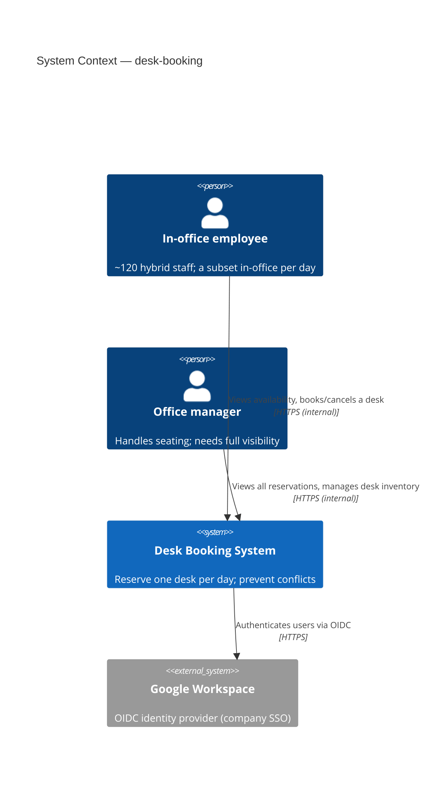
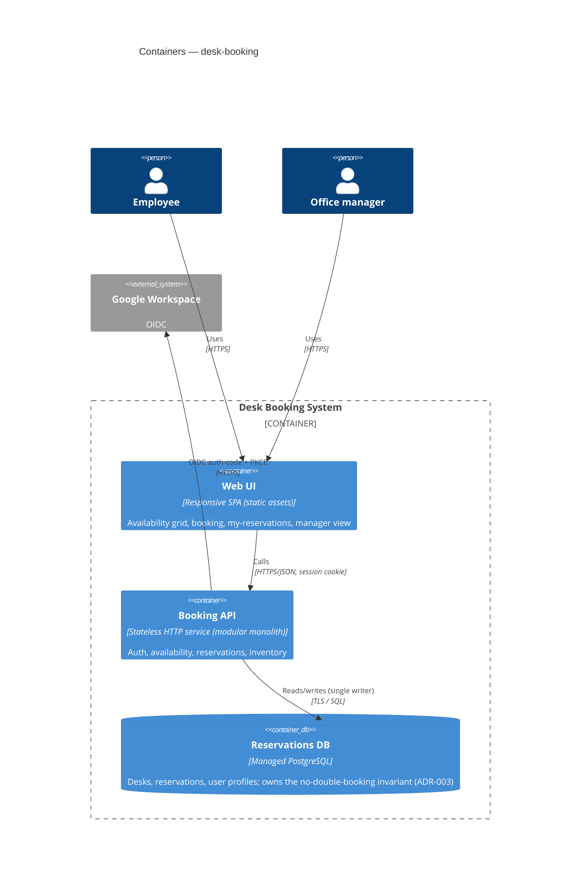
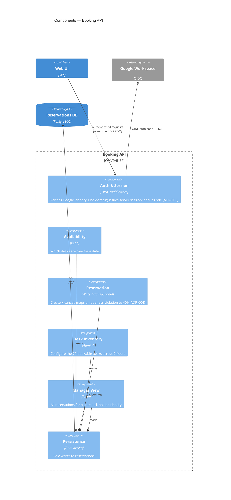

# ADR-desk-booking-001 — System Design Document

## Status

Proposed — 2026-07-31. Backbone for the desk-booking kickoff. Supersedes nothing.

## Context

Sourced from `PRD-desk-booking-001`. The company moves to a 70-desk lease for ~120 staff in ~6 weeks. Today a trust-broken Google Sheet produces daily double-bookings. We need a tool that makes a given desk holdable by at most one employee per day, live before the lease starts.

The hard constraints that shape the architecture:

- **NFR-4 — zero double-bookings under concurrency.** A correctness invariant, not a target. The single decision the whole design is built around.
- **NFR-5 — internal-only.** Not reachable from the public internet.
- **FR-1 — Google SSO only.** No local credentials.
- **Scale — tiny.** ~120 users, ≤120 reservations/day, morning peak assumed ≤120 requests within a 30-minute window (NFR-1).
- **Timeline — ~6 weeks** to a hard external date (NFR-7).

Working assumption from the PRD: bookings are **full-day** (FR-7). Dominant product risk is **adoption/trust** — one wrong seat or a slow page collapses uptake, reinforcing correctness-first, then latency (NFR-2, p95 < 1s).

### The one decision that matters: concurrency correctness

- **A — Single relational DB with a uniqueness invariant on (desk, date).** The insert either succeeds or the database rejects it atomically; the check *is* the write. Application maps rejection to a clean 409.
- **B — Application-level check-then-insert.** A race window exists by construction; closing it needs DB support anyway, so it reduces to A or is simply wrong.
- **C — Serialize bookings through a queue + single worker.** Correct but adds infrastructure, latency, and duplicate handling to solve what the DB solves for free at this scale — over-engineering.

**Chosen: A.** We give up horizontal write-scaling, irrelevant at ≤120 writes/day. The physical mechanism (constraint, transaction, isolation level) is the database-engineer's decision in `ADR-desk-booking-003`; this SDD fixes only that the **reservations data store is the sole owner and enforcer of the no-double-booking invariant, with exactly one writer (the Booking service).**

### Shape of the system

A stateless modular-monolith Booking API and a responsive SPA over one managed PostgreSQL. A monolith, not services: a distributed system here would be refactor-avoidance cost with no requirement behind it.

## C4 — Level 1: System Context

## C4 — Level 2: Containers

## C4 — Level 3: Components

## Key decisions & their ADRs

| Concern | Decision | ADR |
|---|---|---|
| auth | OIDC auth-code + PKCE against Google Workspace, domain-restricted; server-side session; role derived server-side | `ADR-desk-booking-002` |
| database | Single managed PostgreSQL; owns the (desk, date) uniqueness invariant. **Physical schema owned by database-engineer.** | `ADR-desk-booking-003` |
| api | REST `/v1`, JSON snake_case; `POST /reservations` → 201 or **409** on conflict; standard error shape | `ADR-desk-booking-004` |
| observability | Structured JSON logs + correlation ID, RED metrics, health/readiness; single-service (no distributed tracing) | `ADR-desk-booking-005` |
| infrastructure | Single-region managed container platform behind private ingress (IAP/VPN) + managed Postgres | `ADR-desk-booking-006` |
| ci/cd | Git pipeline: build → test → migrate (separate creds) → deploy; staging + prod; expand-contract migrations | `ADR-desk-booking-007` |
| security | Internal-only + default-deny object-level authz, CSRF, rate limit, data minimization, encryption at rest | `ADR-desk-booking-008` |
| testing | **Owned by QA.** Must include a concurrency test proving AC-5 (exactly one winner). | `ADR-desk-booking-009` |

## Cross-cutting constraints

- **Correctness:** zero double-bookings (NFR-4) — enforced at the data store, one writer only.
- **Latency:** availability and booking confirmation p95 < 1s under NFR-1 load (NFR-2, proposed).
- **Availability:** 99.5% monthly, business hours; overnight maintenance acceptable (NFR-3).
- **Scale:** ~120 users, ≤120 reservations/day, peak ≤120 requests / 30 min (NFR-1, proposed).
- **Data minimization:** store only employee name + work email (NFR-6).
- **Retention:** proposed keep current + prior 90 days, then purge (NFR-8, unconfirmed).

## Follow-up Actions

- Resolve open questions gating the domain model — booking window (FR-10), one-desk-per-employee-per-day (FR-9), manager cancel/reassign rights (FR-13), desk attributes (FR-15). These drive `ADR-desk-booking-003`.
- Confirm the deployment target cloud (assumed GCP; see ADR-006).
- Hand the (desk, date) invariant to database-engineer for physical enforcement (ADR-003).
- Hand AC-5 concurrency proof to QA (ADR-009).

## Last verified
2026-07-31
