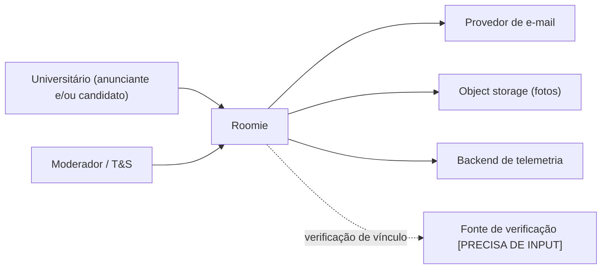
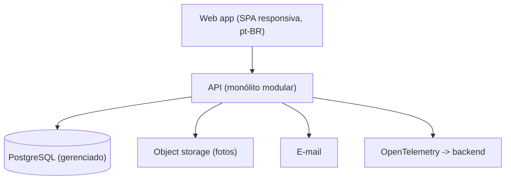
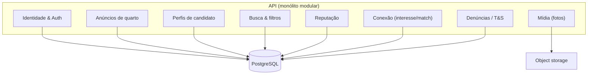

# ADR-ROM-001 — Documento de Design de Sistema (SDD)

## Status
Aceito (provisório — demo) · 2026-07-31

## Contexto
Roomie é um catálogo web (mobile-first, pt-BR) que conecta universitários nas duas pontas de um mesmo mercado — quem oferece quarto/vaga e quem procura — com reputação legível e mediação do primeiro contato só após interesse mútuo. Requisitos em `PRD-ROM-001` (RF-1 a RF-13, RNF-1 a RNF-7).

Vários dimensionadores estão em aberto e afetam esta arquitetura: **escala e escopo geográfico** (RNF-4/RNF-6), **modelo de reputação** (RF-9, coração do produto), **método de verificação de vínculo** (RF-2), **forma da mediação** (RF-11) e **monetização/pagamento** (fora de escopo hoje). Marcados como `[PRECISA DE INPUT]` onde travam uma decisão. A postura é a opção chata: **um monólito modular** que adia distribuição até haver número que a justifique.

### Nível 1 — Contexto de sistema
**O que isto mostra:** quem usa o Roomie e com quais sistemas externos ele fala.

### Nível 2 — Contêineres
**O que isto mostra:** as unidades executáveis e os armazenamentos de dados dentro do Roomie.

### Nível 3 — Componentes (dentro da API)
**O que isto mostra:** os módulos internos da API e quem é dono de cada responsabilidade.

## Decisões-chave & seus ADRs
| Preocupação | Decisão | ADR |
|---|---|---|
| auth | E-mail+senha (Argon2) com sessão em cookie httpOnly; verificação de vínculo provisória | `ADR-ROM-002` |
| database | PostgreSQL gerenciado, único, dono de todos os domínios (definido por outro especialista) | `ADR-ROM-003` |
| api | REST/JSON versionada; interesse/match idempotentes | `ADR-ROM-004` |
| observability | Logs estruturados + métricas + traces via OpenTelemetry | `ADR-ROM-005` |
| infrastructure | AWS via Terraform: ECS Fargate + ALB, RDS PostgreSQL, S3/CloudFront, região sa-east-1 | `ADR-ROM-006` |
| ci/cd | Pipeline trunk-based: lint → test → build → deploy | `ADR-ROM-007` |
| security | Contato oculto até o match; LGPD; autorização por dono de recurso | `ADR-ROM-008` |
| testing | Pirâmide de testes (definido por outro especialista) | `ADR-ROM-009` |

## Restrições transversais
- **Latência:** busca p95 alvo `[PRECISA DE INPUT: RNF-3]` — projeta-se índices em Postgres bastarem no MVP.
- **Escala:** usuários/anúncios simultâneos `[PRECISA DE INPUT: RNF-4]`; picos sazonais de matrícula (hipótese). Monólito com scale-out horizontal cobre a hipótese.
- **Disponibilidade:** SLA `[PRECISA DE INPUT: RNF-5]`; região única no MVP (sem multi-região).
- **Privacidade:** dados de contato só visíveis após match (RF-11); LGPD `[PRECISA DE INPUT: requisitos específicos]`.

## Follow-up Actions
- Resolver escala/escopo (RNF-4/6) antes de dimensionar infra em `ADR-ROM-006`.
- Definir modelo de reputação (RF-9) — abre um ADR de feature (`ADR-ROM-010+`).
- Confirmar forma da mediação (RF-11) — decide se há chat interno (novo contêiner) ou troca de contato.

## Last verified
2026-07-31
