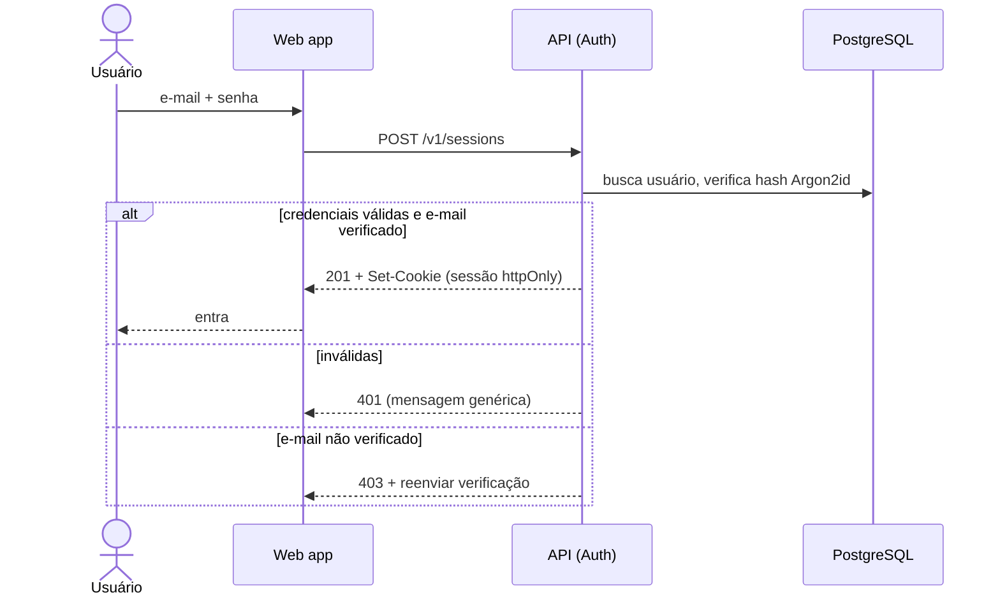

# ADR-ROM-002 — Autenticação

## Status
Aceito (provisório — demo) · 2026-07-31

## Contexto
RF-1 exige criar conta e autenticar; RF-2 exige registrar vínculo estudantil, mas o **método de verificação (e-mail institucional / documento / nenhum) é `[PRECISA DE INPUT]`**. RF-3 exige um único cadastro atuando nas duas pontas. Público mobile-first (RNF-1). Dados de contato são sensíveis e só liberam após match (RF-11), então a identidade precisa ser confiável mas o cadastro precisa ter baixo atrito.

## Decisão
- **Autenticação própria por e-mail + senha**, senha com **Argon2id**, **sessão em cookie `httpOnly`, `Secure`, `SameSite=Lax`** (server-side session). Boring, portátil, sem lock-in.
- **Um usuário = uma conta**, com papéis de anunciante e candidato coexistindo no mesmo cadastro (RF-3). Papel não é identidade; é capacidade.
- **Verificação de e-mail obrigatória** (link de confirmação) antes de publicar.
- **Verificação de vínculo estudantil: provisória.** Default MVP = confirmação de e-mail institucional (`domínio da instituição`), marcada como `[PRECISA DE INPUT]` até o produto confirmar. Documento/KYC fica fora do MVP.

## Alternativas
| Opção | Por que não (agora) |
|---|---|
| IdP gerenciado (Auth0/Cognito/Firebase) | Menos código de segurança, porém custo por MAU e lock-in; reabrir se o time for muito pequeno |
| Somente magic link (sem senha) | Menos atrito, mas dependência total de entrega de e-mail; reconsiderar |
| Login social (Google) | Bom para atrito, mas não prova vínculo estudantil; pode complementar depois |

## Tradeoffs
Ganhamos portabilidade e controle; **abrimos mão** de terceirizar a superfície de segurança de credenciais (reset de senha, rotação, MFA passam a ser nossos). Sessão server-side custa um lookup por request, mas dá revogação imediata — troca deliberada contra JWT stateless.

## Consequências
- Precisamos de fluxos de reset de senha e reenvio de verificação desde o MVP.
- MFA fica como follow-up (não MVP).
- A regra de "quem pode publicar" depende do estado de verificação — contrato exposto em `ADR-ROM-004`.

## Follow-up Actions
- `[PRECISA DE INPUT]` método de verificação de vínculo (RF-2) — trava a política final.
- Definir política de senha e expiração de sessão com `ADR-ROM-008`.

## Last verified
2026-07-31
