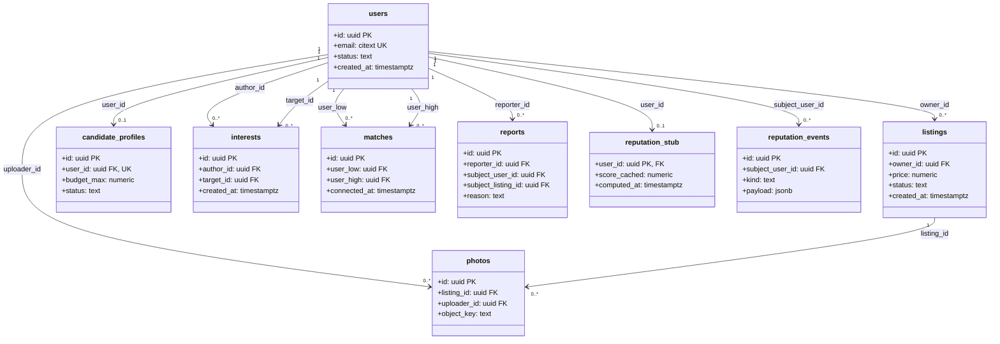

# ADR-ROM-003 — Banco de Dados

## Status
Aceito (provisório — demo) · 2026-07-31

## Contexto
Um único PostgreSQL gerenciado é dono de todos os domínios (`ADR-ROM-001`). O ponto de correção herdado de `ADR-ROM-004` é a **conexão mútua**: interesse repetido não pode duplicar (idempotência via `PUT`) e um match mútuo é único por par não-ordenado. Essas duas invariantes têm de viver no banco — não na aplicação — porque são o que sobrevive a corridas. O **modelo de reputação (RF-9)** é o coração do produto e está indefinido; modelamo-lo como stub deliberadamente fino. Escala (RNF-4) e escopo geográfico (RNF-6) estão em aberto, então o esquema é normalizado e conservador, sem particionamento nem desnormalização prematura.

## Decisão
PostgreSQL, esquema normalizado. Convenções: `snake_case`, PK `id uuid` (`gen_random_uuid()`), timestamps `timestamptz NOT NULL DEFAULT now()`, `citext` para e-mail, enums via tabelas de domínio/`CHECK` em vez de tipo `ENUM` nativo (evolução mais barata). **Toda FK recebe índice** (Postgres não cria sozinho).



**As entidades — o que cada uma é e por que existe.** Cada tabela mapeia a um
requisito do `PRD-ROM-001`; nenhuma existe "por completude".

| Entidade | O que é / por que existe (negócio) | RF |
|---|---|---|
| `users` | A pessoa universitária. Uma única conta atua nas **duas pontas** (anuncia e procura) — é a base de identidade e de confiança do produto. | RF-1, RF-3 |
| `listings` | O **anúncio de um quarto/vaga** publicado por um dono: é o catálogo em si, com campos padronizados para serem comparáveis. | RF-4, RF-5, RF-6 |
| `candidate_profiles` | O anúncio do **lado demanda**: quem procura se descreve (o que quer, faixa de valor). Um por usuário — o mesmo cadastro. Sem ele só existiria a oferta, e não haveria mercado. | RF-7 |
| `photos` | Fotos de um anúncio, guardadas como objetos (`object_key` no S3). Anúncio sem foto não é comparável nem confiável — por isso são entidade, não um campo solto. | RF-4 |
| `interests` | Um **clique direcionado** de interesse (autor → alvo). É a matéria-prima do match; **direcional** porque A querer B ≠ B querer A. | RF-10 |
| `matches` | O interesse **recíproco concretizado**: o par não-ordenado que libera o contato e conta como **conexão-norte** (a métrica de sucesso do Roomie). Existe separado de `interests` porque é um fato do produto, não um clique. | RF-11, RF-12 |
| `reports` | **Denúncia** de um anúncio ou usuário para triagem — a rede de trust & safety que protege as duas pontas. | RF-13 |
| `reputation_stub` | O **agregado de reputação** exibido antes do contato (o diferencial central do produto). Hoje um stub: `score_cached` nulo = "sem histórico". | RF-9 |
| `reputation_events` | Log append-only dos **sinais** que futuramente compõem a reputação. Existe já para não migrar a leitura quando o modelo (RF-9) for definido. | RF-9 |

**As duas invariantes de correção** (encanam `ADR-ROM-004`):

```sql
-- interesse: par direcionado (autor -> alvo) único; suporta o PUT idempotente
ALTER TABLE interests
  ADD CONSTRAINT uq_interest_pair UNIQUE (author_id, target_id);
ALTER TABLE interests
  ADD CONSTRAINT ck_interest_not_self CHECK (author_id <> target_id);

-- match: par NÃO-ordenado único. Normaliza {A,B} em (menor, maior)
ALTER TABLE matches
  ADD CONSTRAINT ck_match_order CHECK (user_low < user_high);
ALTER TABLE matches
  ADD CONSTRAINT uq_match_pair UNIQUE (user_low, user_high);
```

Ordenar o par em `(user_low, user_high)` com `CHECK (user_low < user_high)` transforma "par não-ordenado único" em um `UNIQUE` comum — uma corrida perde e converge ao mesmo match.

**Reputação — stub provisório.** `reputation_stub` guarda um agregado `score_cached` **nullable** (nulo = ainda sem reputação, exibível como "sem histórico"). `reputation_events` é um log append-only que registra futuros sinais. **A regra de composição de `score_cached` é `[PRECISA DE INPUT]` (RF-9)** — nada calcula esse valor hoje; a coluna existe para não migrar a leitura depois.

## Alternativas
| Opção | Por que não |
|---|---|
| `ENUM` nativo para `status`/`reason` | Alterar valor exige migração de tipo; `CHECK`/tabela de domínio evolui mais barato |
| Unicidade do match só na aplicação | Move a invariante para fora do banco — frágil sob corrida (a falha que `ADR-ROM-004` exige evitar) |
| Guardar interesse como par não-ordenado | Interesse **é** direcionado (A→B ≠ B→A); ordenar destruiria a semântica de reciprocidade |
| Reputação como coluna em `users` agora | Cristaliza um modelo indefinido; stub isolado adia a decisão sem bloquear leitura |
| `bigserial` como PK | UUID evita enumeração de recursos e coordena melhor multi-instância |

## Tradeoffs
UUID v4 como PK **abre mão** de localidade de índice (páginas mais esparsas que chave sequencial) em troca de IDs não-enumeráveis e geração distribuída — aceitável na escala do MVP; reavaliar (UUID v7) se RNF-4 apertar. Normalizar em vez de desnormalizar **abre mão** de leituras pré-juntadas por consistência e flexibilidade de filtro (RF-8) enquanto o volume é modesto. O stub de reputação **abre mão** de completude por não travar o build num modelo `[PRECISA DE INPUT]`.

## Consequências
- A app trata interesse como **upsert** (`INSERT ... ON CONFLICT (author_id, target_id) DO NOTHING/UPDATE`) — a unicidade do banco é a rede de segurança do `PUT` idempotente.
- Ao formar match, a app **ordena o par** (`least`/`greatest`) antes de inserir; a transação que cria o match, libera contato e registra a conexão-norte (RF-12) é única (`ADR-ROM-004`).
- `reputation_stub.score_cached` nulo é estado válido e esperado no MVP — leitores devem renderizar "sem reputação", nunca `0`.
- Dados de contato ficam em colunas cuja exposição depende de match (privacidade em `ADR-ROM-008`); o esquema não os inclui em nenhuma view pública por padrão.
- Dimensionamento de índices de busca (RF-8) fica `[PRECISA DE INPUT]` até RNF-4/RNF-6.

## Follow-up Actions
- Definido o modelo de reputação (RF-9), especificar a regra de composição de `score_cached` e os `kind` de `reputation_events` — abre ADR de feature (`ADR-ROM-010+`).
- Fechar critérios de busca/filtro (RF-8) para desenhar índices compostos deliberados (cada índice com a query que serve) na fase de build.
- Confirmar escala (RNF-4) antes de considerar UUID v7, particionamento ou réplicas de leitura.
- Modelar denúncia (`reports`) com `CHECK` garantindo exatamente um alvo (`subject_user_id` XOR `subject_listing_id`) quando o fluxo de moderação (RF-13) for definido.

## Last verified
2026-07-31
