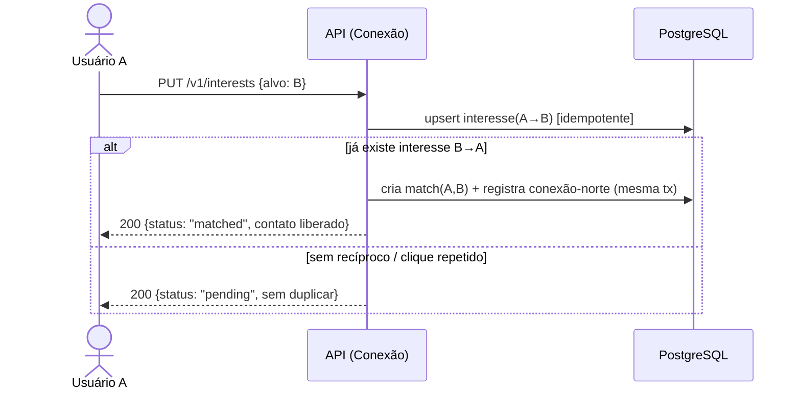

# ADR-ROM-004 — API

## Status
Aceito (provisório — demo) · 2026-07-31

## Contexto
A API serve a web app (RNF-1) e cobre anúncios (RF-4 a RF-6), perfis de candidato (RF-7), busca/filtros (RF-8), reputação (RF-9), interesse/match (RF-10 a RF-12) e denúncias (RF-13). O ponto crítico de correção é **conexão mútua**: o critério de aceite exige que dois cliques de interesse do mesmo usuário no mesmo alvo **não** criem interesse/match duplicado, e que o match libere contato e registre a conexão-norte (RF-12).

## Decisão
- **REST/JSON versionada por caminho (`/v1`).** Boring e cacheável.
- **Manifestar interesse é idempotente:** `PUT /v1/interests` com par (autor, alvo) como chave lógica. Reenvio retorna o mesmo recurso (200), nunca duplica.
- **O match não é um endpoint que o cliente cria** — é derivado pelo servidor quando existe interesse recíproco, dentro de uma transação, garantindo unicidade do par. A liberação de contato e o registro da conexão-norte acontecem nessa mesma transação.
- **Contato oculto por padrão:** payload de perfil/anúncio nunca inclui dados de contato antes do match (ver `ADR-ROM-008`).
- **Erros padronizados** (RFC 9457 problem+json); estado vazio de busca é 200 com lista vazia (não erro).

## Alternativas
| Opção | Por que não |
|---|---|
| GraphQL | Flexível, mas overkill para MVP e complica cache/rate-limit |
| Match como POST explícito pelo cliente | Move a regra de unicidade para o cliente — frágil sob corrida |
| Contato no payload + esconder no front | Vazamento por inspeção; segurança tem de ser no servidor |

## Tradeoffs
Idempotência via `PUT`+chave lógica **abre mão** da semântica ingênua de POST e exige uma restrição de unicidade no banco (definida em `ADR-ROM-003`). REST simples **abre mão** de flexibilidade de query rica — aceitável enquanto a busca (RF-8) é filtro estruturado.

## Consequências / Failure modes
- **Duas corridas de interesse simultâneas:** unicidade do par no banco + transação evitam match/conexão duplicados; o segundo perde a corrida e converge ao mesmo estado.
- **Chamada a storage/e-mail expira:** operação de contato não depende dela; efeitos colaterais (notificação) vão para retry assíncrono, nunca bloqueiam o match.
- **Mudança de contrato:** breaking changes exigem novo `/v2` com período de convivência — sem quebra silenciosa.
- Forma exata da mediação (chat vs. troca de contato, RF-11) é `[PRECISA DE INPUT]`; o contrato acima expõe "contato liberado" sem fixar o canal.

## Follow-up Actions
- Especificar OpenAPI dos recursos ao lado de `ADR-ROM-003`.
- Rate-limiting de interesse/denúncia com `ADR-ROM-008`.

## Last verified
2026-07-31
