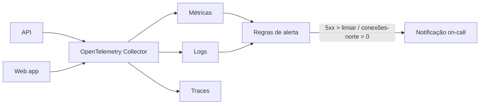

# ADR-ROM-005 — Observabilidade

## Status
Aceito (provisório — demo) · 2026-07-31

## Contexto
Greenfield sem alvos numéricos: latência de busca (RNF-3), SLA (RNF-5) e escala (RNF-4) são `[PRECISA DE INPUT]`. Sem esses números não há SLO formal, mas há sinais que já importam: saúde da API, o funil-norte (interesse → match → conexão, RF-12) e falhas de entrega de e-mail (bloqueiam login e verificação, `ADR-ROM-002`).

## Decisão
- **Instrumentação única via OpenTelemetry** (logs estruturados JSON + métricas + traces), exportada para um backend gerenciado — sem lock-in de SDK.
- **Sinais mínimos do MVP:** taxa de erro e latência p95 por rota; contadores do funil-norte; falhas de e-mail; saturação (CPU/conexões de banco).
- **Correlação por `request_id`** propagado do web app à API e aos logs.
- **Alertas mínimos:** erro 5xx acima de limiar, e queda a zero de conexões-norte (indica quebra no caminho crítico do produto).

## Alternativas
| Opção | Por que não |
|---|---|
| Só logs (sem métricas/traces) | Barato, mas cego para latência e funil; retrabalho depois |
| Stack self-hosted (Prometheus+Grafana+Loki) | Poder total, mas custo operacional alto para MVP |
| APM proprietário desde já | Rápido, mas lock-in e custo antes de haver escala |

## Tradeoffs
OpenTelemetry **abre mão** de simplicidade imediata (mais setup que "só logs") em troca de portabilidade e de traces desde o dia 1. Alertar em "conexões-norte = 0" acopla observabilidade a uma métrica de produto — deliberado: é o sinal mais barato de que o produto quebrou.

## Consequências
- Limiares de alerta ficam provisórios até RNF-3/4/5 virarem números; até lá, alertas são de sanidade, não SLO.
- Custo de telemetria cresce com volume — revisar amostragem quando a escala for conhecida.

## Follow-up Actions
- Converter RNF-3/5 em SLOs quando `[PRECISA DE INPUT]` for resolvido.
- Definir retenção de logs alinhada à LGPD com `ADR-ROM-008`.

## Last verified
2026-07-31
