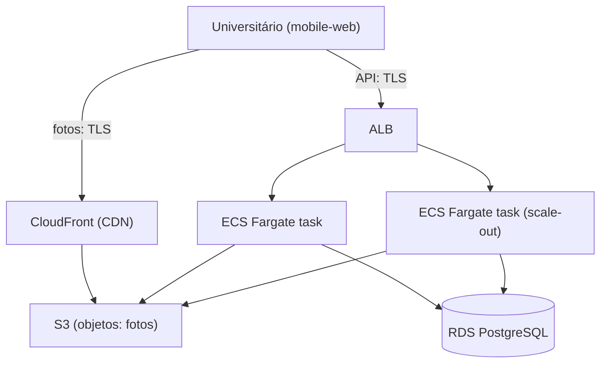

# ADR-ROM-006 — Infraestrutura

## Status
Aceito (provisório — demo) · 2026-07-31

## Contexto
O default de stack do kickoff aplica-se porque o `brief.md` não define campo `Infra`: **infraestrutura na AWS, provisionada com Terraform (IaC)**. A API é um monólito modular **stateless** — a sessão vive no PostgreSQL (`ADR-ROM-002`), não em memória — logo escala horizontalmente sem afinidade de sessão. O banco é PostgreSQL gerenciado (`ADR-ROM-003`) e há fotos como objetos (RF-4). Escala (RNF-4), SLA (RNF-5) e escopo geográfico (RNF-6) seguem `[PRECISA DE INPUT]`; comprometemos a plataforma, mas mantemos o **dimensionamento** (tamanho de instância/DB, multi-AZ, multi-região) provisório.

## Decisão
| Preocupação | Escolha AWS |
|---|---|
| IaC | **Terraform** versionado, aplicado pela pipeline (`ADR-ROM-007`). Estado remoto em **S3 + trava DynamoDB** (default chato) |
| Compute | **ECS Fargate** rodando o monólito, com scale-out horizontal por múltiplas tasks |
| Entrada | **ALB** com TLS terminado por certificado **ACM** |
| Banco | **Amazon RDS for PostgreSQL** — backups automáticos + PITR, cifrado em repouso (KMS) |
| Fotos | **S3** para objetos + **CloudFront** como CDN |
| Região | **sa-east-1 (Brasil)** como default sensato, redimensionável |
| Tamanho/AZ | vCPU/memória da task, classe RDS e **multi-AZ vs single-AZ** ⇒ `[PRECISA DE INPUT]` (RNF-4/RNF-5) |

Sem Kubernetes autogerido e sem microsserviços no MVP — reabrem com escala.

## Alternativas
| Opção | Por que não (agora) |
|---|---|
| **EKS (Kubernetes)** | Poder de orquestração que o monólito não usa; custo operacional (control plane, upgrades) sem carga que o justifique. Reabrir se surgirem múltiplos serviços |
| **Lambda (serverless)** | Bom para picos sazonais, mas cold start e limites de request penalizam uma API relacional com sessão em DB; reavaliar se a carga for muito intermitente |
| **Multi-região** | Complexidade de replicação e failover sem SLA (RNF-5) que a exija; único-região BR cobre latência local. Reabrir com `[PRECISA DE INPUT]` |
| PaaS genérico (Heroku/Render) | Menos boilerplate, mas o default de stack é AWS+Terraform; evita lock-in de PaaS |

## Tradeoffs
Comprometer com AWS+Terraform **abre mão** de neutralidade de nuvem em troca de IaC reprodutível e serviços gerenciados (RDS/S3/ALB) que reduzem operação. ECS Fargate **abre mão** de controle fino do runtime (vs. EC2/EKS) por menos operação. Região única **abre mão** de resiliência geográfica por simplicidade — decisão amarrada ao SLA ainda aberto.

## Consequências / Failure modes
- **Falha de AZ (single-AZ):** RDS single-AZ implica downtime até restore. Mitigação pendente = multi-AZ quando RNF-5 fechar (`[PRECISA DE INPUT]`).
- **Task não-saudável:** ALB health check remove a task; ECS recria. Como a sessão está no RDS, nenhuma sessão se perde no scale-in/out.
- **Saturação do RDS:** ponto único de escrita; sob pico sazonal, escalar vertical primeiro, réplica de leitura depois (`ADR-ROM-003`).
- **Drift de estado Terraform:** trava DynamoDB evita apply concorrente; qualquer mudança manual no console é drift a reconciliar.

## Follow-up Actions
- Resolver RNF-4/RNF-5/RNF-6 para fixar classe RDS, tamanho de task, multi-AZ e réplicas.
- Definir KMS keys e política de retenção de backup com `ADR-ROM-008`.
- Confirmar multi-região só se o SLA exigir.

## Last verified
2026-07-31
