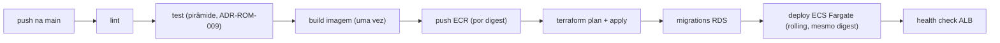

# ADR-ROM-007 — CI/CD

## Status
Aceito (provisório — demo) · 2026-07-31

## Contexto
A pipeline entrega o monólito ao runtime AWS de `ADR-ROM-006`: **ECS Fargate** atrás de **ALB**, com **RDS PostgreSQL**, **S3/CloudFront** e infraestrutura em **Terraform** (estado em S3 + trava DynamoDB). Precisa ser trunk-based, previsível e sem deploy manual. A API stateless (`ADR-ROM-002`) permite rollout sem drenar sessões.

## Decisão
- **Trunk-based:** cada push na main dispara a pipeline.
- **Build-once, promote-the-same-image:** a imagem construída uma vez é publicada no **ECR** por digest e **promovida** por estágios — nunca rebuild por ambiente.
- **Terraform pela pipeline:** `plan` revisado, `apply` na main. Estado remoto (S3 + DynamoDB) é a fonte de verdade da infra.
- **Migrations de banco** rodam como passo explícito antes do deploy (compatíveis-para-frente; `ADR-ROM-003`).
- **Deploy ECS rolling** com health check no ALB; rollback = re-apontar para o digest anterior.

## Alternativas
| Opção | Por que não (agora) |
|---|---|
| Rebuild por ambiente | Quebra a garantia "o que testei é o que subiu"; promover o mesmo digest é o default seguro |
| `terraform apply` manual | Reintroduz drift e passo humano frágil; a pipeline é a única a aplicar |
| Deploy direto sem registry | Perde imutabilidade e rollback por digest |
| GitOps/ArgoCD | Pressupõe Kubernetes, que `ADR-ROM-006` recusa no MVP |

## Tradeoffs
Terraform na pipeline **abre mão** de mudança rápida via console em troca de reprodutibilidade e auditoria. Build-once **abre mão** de flexibilidade de configurar por build em troca de paridade entre ambientes (config vem por variável de ambiente/parameter store, não por rebuild). Rolling deploy **abre mão** de troca instantânea (blue/green) por simplicidade — reabrir se o SLA (RNF-5) exigir zero-downtime garantido.

## Consequências / Failure modes
- **`terraform apply` falha no meio:** estado pode ficar parcial; a trava DynamoDB impede apply concorrente, e o re-run reconcilia. Mudanças destrutivas exigem revisão do `plan`.
- **Migration incompatível:** um deploy pode rodar contra schema antigo durante o rolling — por isso migrations são compatíveis-para-frente (expand/contract), nunca breaking em um passo.
- **Imagem ruim promovida:** health check do ALB barra tasks não-saudáveis; rollback re-aponta o digest anterior. Sessões sobrevivem (estão no RDS).
- **Pico sazonal durante deploy:** rolling mantém tasks servindo; auto-scaling do ECS (parâmetros `[PRECISA DE INPUT]`, RNF-4) absorve carga.

## Follow-up Actions
- Definir gates de aprovação para `terraform apply` em produção.
- Parametrizar auto-scaling do ECS quando RNF-4 fechar.
- Avaliar blue/green se RNF-5 exigir zero-downtime.

## Last verified
2026-07-31
