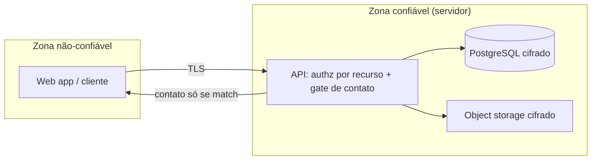

# ADR-ROM-008 — Segurança

## Status
Aceito (provisório — demo) · 2026-07-31

## Contexto
O ativo mais sensível é o **dado de contato**, que só pode aparecer após match (RF-11, RNF-7), e os dados pessoais de estudantes sob **LGPD** (requisitos específicos `[PRECISA DE INPUT]`). Há superfícies de abuso: denúncia (RF-13), spam de interesse (RF-10) e upload de fotos (RF-4). Verificação de vínculo é `[PRECISA DE INPUT]` (RF-2), então a identidade não é fortemente garantida no MVP.

## Decisão
- **Autorização no servidor por dono de recurso:** cada leitura/escrita valida que o solicitante pode ver aquele dado. Contato só é servido quando existe match confirmado (`ADR-ROM-004`) — nunca no payload antes disso.
- **Fronteira de confiança:** tudo do cliente é não-confiável; validação e regras de visibilidade vivem na API, nunca no front.
- **Criptografia:** TLS em trânsito; dados em repouso cifrados (recursos gerenciados, `ADR-ROM-006`); senhas com Argon2id (`ADR-ROM-002`).
- **Anti-abuso:** rate-limiting em login, interesse e denúncia; validação de tipo/tamanho e varredura de uploads.
- **LGPD (provisório):** minimização de dados, base legal registrada, e trilha para exclusão/portabilidade — detalhes `[PRECISA DE INPUT]`.

## Alternativas
| Opção | Por que não |
|---|---|
| Ocultar contato só na UI | Vaza por chamada direta à API; segurança tem de ser no servidor |
| Sem rate-limit no MVP | Convite a spam de interesse e abuso de denúncia |
| KYC/documento desde já | Alto atrito e dado sensível sem necessidade comprovada — `[PRECISA DE INPUT]` |

## Tradeoffs
Authz por recurso **abre mão** de simplicidade (cada endpoint carrega a checagem) em troca de conter o vazamento de contato — o risco central do produto. Verificação leve de vínculo **abre mão** de garantia forte de identidade por baixo atrito de cadastro; a denúncia (RF-13) é a rede de contenção.

## Consequências / Failure modes
- **Bypass de autorização:** mitigado por checagem centralizada e testes de authz (`ADR-ROM-009`).
- **Denúncia sem moderação real:** fluxo de moderação é `[PRECISA DE INPUT]` (RF-13); no MVP a denúncia só registra para triagem — risco aceito e sinalizado.
- **Retenção de logs vs. LGPD:** logs (`ADR-ROM-005`) não devem conter contato/PII; revisar quando requisitos LGPD forem definidos.

## Follow-up Actions
- `[PRECISA DE INPUT]` requisitos LGPD e método de verificação (RF-2) e fluxo de moderação (RF-13).
- Política de senha/MFA e retenção com `ADR-ROM-002` e `ADR-ROM-005`.

## Last verified
2026-07-31
