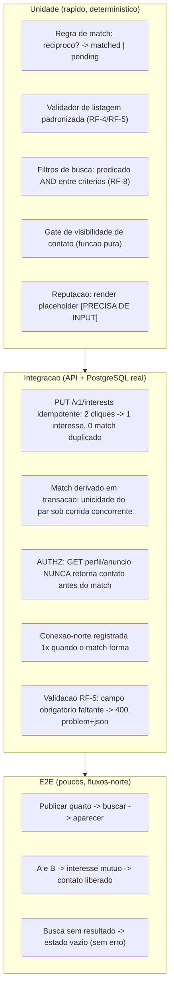

# ADR-ROM-009 — Testes

## Status
Aceito (provisório — demo) · 2026-07-31

## Contexto
A correção do Roomie concentra-se em dois pontos de alto risco: a **conexão mútua** (interesse idempotente, match derivado no servidor, sem duplicidade sob corrida — RF-10..12, `ADR-ROM-004`) e o **vazamento de contato** (dado de contato nunca aparece antes do match — RF-11, RNF-7, `ADR-ROM-008`). Somam-se a validação da listagem padronizada (RF-4/RF-5) e o estado vazio de busca (RF-8). O modelo de reputação (RF-9) é `[PRECISA DE INPUT]` — só pode ser testado além do "renderiza" quando a regra de composição existir. A estratégia precisa provar comportamento, ser determinística (sem relógio, rede ou ordem) e concentrar rigor onde uma falha silenciosa custa caro.

## Decisão
Pirâmide de testes com o grosso do esforço na base (unidade rápida), integração cobrindo authz e persistência transacional, e uma casca fina de e2e nos fluxos-norte.

**Comportamentos de maior rigor (não podem regredir):**

| Área | O que o teste prova | Casos de borda obrigatórios |
|---|---|---|
| Match idempotente (RF-10..12) | 2º clique não cria interesse/match/conexão duplicado; retorna mesmo recurso (200) | clique repetido; interesse recíproco simultâneo (corrida); auto-interesse |
| Contato oculto (RF-11, `ADR-ROM-008`) | API não inclui contato no payload antes do match, mesmo por chamada direta | pré-match; solicitante não-dono; após match libera |
| Listagem padronizada (RF-4/RF-5) | campo obrigatório ausente bloqueia publicação e aponta o campo | cada obrigatório vazio; limite de fotos/tamanho |
| Busca (RF-8) | filtros combinam em AND; sem resultado devolve estado vazio 200 | zero resultados; filtro em fronteira de valor |
| Reputação (RF-9) | apenas renderização; regra `[PRECISA DE INPUT]` | não testável até o modelo existir |

**Cobertura:** alvo global `[PRECISA DE INPUT]`; independentemente do número, o caminho de match e o gate de contato exigem cobertura de ramos, não só de linhas. Testes rodam no pipeline (`ADR-ROM-007`), bloqueando merge em falha.

## Alternativas
| Opção | Por que não |
|---|---|
| Muitos e2e, pouca unidade (pirâmide invertida) | Lento, instável, difícil localizar o defeito |
| Só mockar o banco na integração | Não pega unicidade do par nem transação — o risco central |
| Ocultar contato testado só no front | Não prova o gate no servidor; vazamento por chamada direta escapa |

## Tradeoffs
Integração com PostgreSQL real **abre mão** de velocidade em troca de provar a restrição de unicidade e a transação de match — impossível de verificar com banco mockado. E2e fino **abre mão** de cobertura ampla de UI em troca de estabilidade e sinal claro.

## Consequências
- Regressão no gate de contato ou na idempotência falha o build antes do deploy.
- Reputação (RF-9) fica com cobertura parcial declarada até o modelo ser definido — dívida sinalizada, não esquecida.
- Números de cobertura e p95 de busca (RNF-3) ficam `[PRECISA DE INPUT]`; a estratégia não inventa metas.

## Follow-up Actions
- Definir alvo de cobertura e p95 de busca quando escala/escopo (RNF-3/4/6) forem resolvidos.
- Ampliar suíte de reputação quando o modelo (RF-9) sair de `[PRECISA DE INPUT]`.
- Adicionar teste de carga de interesse/denúncia junto ao rate-limiting (`ADR-ROM-008`).

## Last verified
2026-07-31
