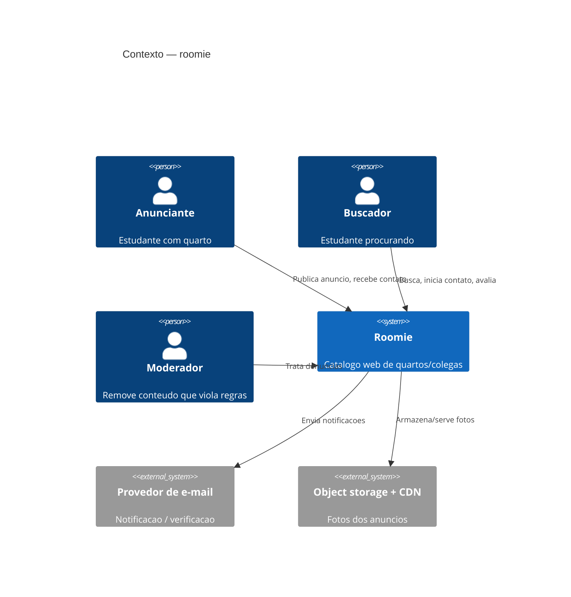
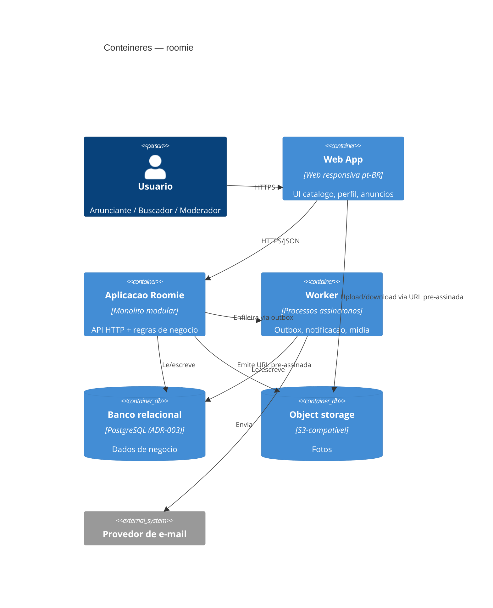
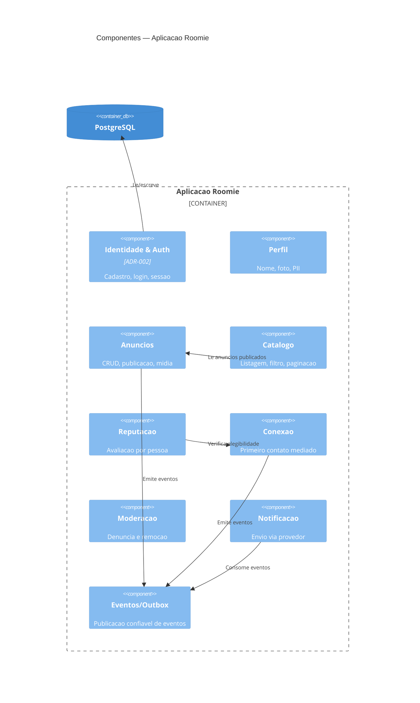

# ADR-roomie-001 — System Design Document

## Status
Proposto

## Contexto
Formaliza o desenho de sistema para o `PRD-roomie-001`: catálogo web (web responsiva, pt-BR) onde universitários publicam/procuram quartos e colegas, com reputação por pessoa e mediação do primeiro contato. Restrição transversal: LGPD (PII, fotos, contato). A decisão-mãe é a forma de implantação; as demais estão nos ADRs de backbone.

## C4 — Nível 1: Contexto do Sistema

## C4 — Nível 2: Contêineres

## C4 — Nível 3: Componentes (Aplicação Roomie)

## Decisões-chave e seus ADRs

| Tema | Decisão | ADR |
|---|---|---|
| auth | Sessão via cookie httpOnly, primitivas do framework, hash Argon2 | `ADR-roomie-002` |
| database | Relacional único (PostgreSQL); esquema físico é do database-engineer | `ADR-roomie-003` |
| api | REST/JSON `/v1`, paginação por cursor, erro padronizado, idempotência | `ADR-roomie-004` |
| observability | Logs estruturados + correlation_id, métricas RED, alerta por sintoma | `ADR-roomie-005` |
| infrastructure | Monólito modular + worker em contêiner, PaaS gerenciado, região Brasil | `ADR-roomie-006` |
| ci/cd | Trunk-based, expand-then-contract, deploy rolling | `ADR-roomie-007` |
| security | Default-deny, autorização por objeto, LGPD by design | `ADR-roomie-008` |
| testing | (a definir pelo qa) | `ADR-roomie-009` |

## Propriedade de dados (um escritor por tabela)

| Módulo (escritor) | Dado que possui | Consumidores leem via |
|---|---|---|
| Identidade & Auth | credenciais, sessões | — |
| Perfil | dados pessoais, foto de perfil (PII) | API de módulo |
| Anúncios | anúncios, referências de mídia | Catálogo (leitura), evento |
| Catálogo | nenhum (modelo de leitura) | lê de Anúncios |
| Reputação | avaliações, score agregado por pessoa | Perfil/Anúncios exibem |
| Conexão | registros de primeiro contato | Reputação (elegibilidade), métrica |
| Moderação | denúncias, decisões | — |
| Notificação | log de envio, preferências | — |

Regra: nenhum módulo escreve na tabela de outro. Cruzamento é por chamada de módulo ou evento de outbox. O esquema físico (colunas, tipos, índices) é decidido no `ADR-roomie-003`.

## Restrições transversais

| Restrição | Valor | Origem |
|---|---|---|
| Latência catálogo/detalhe | p95 ≤ 2 s em 4G | RNF-01 `[PRECISA DE INPUT: confirmar]` |
| Disponibilidade | ≥ 99,5% mensal | RNF-03 `[PRECISA DE INPUT: confirmar]` |
| Escala v1 | usuários/anúncios | RNF-02 `[PRECISA DE INPUT]` |
| Conformidade | LGPD: base legal, consentimento, exclusão, portabilidade | RNF-05 |
| Plataforma | web responsiva, ≥ 360 px, navegadores modernos | RNF-04 |
| Idioma | pt-BR | RNF-08 |

## Ações de acompanhamento
- Resolver perguntas em aberto do PRD que travam contratos: elegibilidade de cadastro (2), modelo de reputação (3), mecanismo/canal do primeiro contato (4).
- `ADR-roomie-003` (database-engineer): esquema físico por módulo.
- `ADR-roomie-009` (qa): estratégia de teste, incl. testes de contrato.

## Última verificação
2026-07-31
