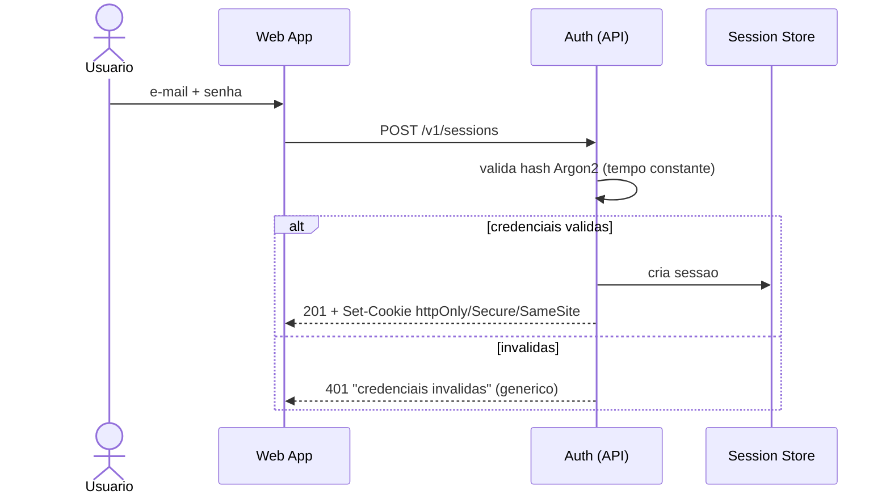

# ADR-roomie-002 — Autenticação

## Status
Proposto

## Contexto
RF-01/02/03, RNF-06: publicar, contatar e avaliar exigem autenticação; credenciais nunca em texto claro. Cliente é web responsiva (mesma origem). A regra de elegibilidade do cadastro está em aberto.

## Decisão
Autenticação por **sessão em cookie**, usando as primitivas do framework (nunca sessão/token/senha caseiros):

- Login em `POST /v1/sessions`; cookie `httpOnly`, `Secure`, `SameSite=Lax`.
- Estado de sessão em **store compartilhado** (não em memória de processo) — a aplicação permanece stateless e escala horizontalmente.
- Senhas com **Argon2** (ou bcrypt); comparação em tempo constante.
- Falha de autenticação **genérica** ("credenciais inválidas"), sem oráculo de enumeração.
- Rate limit em login, cadastro e reset por usuário e por IP; `429` com `Retry-After`.
- O **gate de elegibilidade** (e-mail acadêmico vs. aberto) é um passo isolado no cadastro. `[PRECISA DE INPUT: regra de RF-03]`

## Alternativas
1. **JWT stateless em localStorage** — escala sem store, mas exposto a XSS (token legível por JS) e sem revogação instantânea.
2. **IdP terceiro / SSO acadêmico** — resolve elegibilidade se o cadastro for restrito, mas adiciona dependência externa e acoplamento temporal antes de a regra estar decidida.
3. **Sessão em cookie (escolhida)** — token nunca em JS, revogação imediata, custo de um store compartilhado.

## Trade-offs
Abrimos mão da pureza stateless "sem store" do JWT: precisamos operar um store de sessão. Em troca, eliminamos a superfície de XSS de token e ganhamos revogação. A aplicação continua stateless (o estado está no store, não no processo).

## Consequências
- Depende do store de sessão (ver `ADR-roomie-006`); indisponibilidade dele derruba o login.
- SSO acadêmico pode ser adicionado depois como provedor adicional sem quebrar o cookie.

## Ações de acompanhamento
- `[PRECISA DE INPUT]` regra de elegibilidade (2) — decide se há verificação de e-mail e/ou SSO.

## Última verificação
2026-07-31
