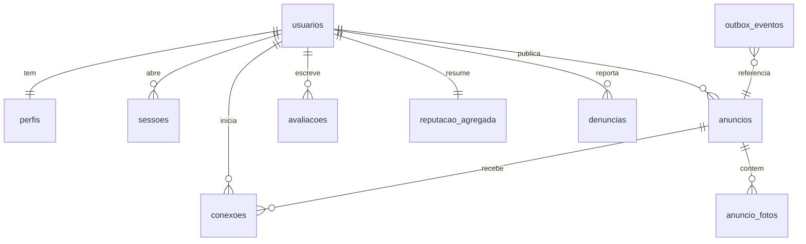

# ADR-roomie-003 — Banco de Dados

## Status
Proposto. Documento de decisão de kickoff — não é migração. As migrações versionadas são escritas depois, por mim, e rodadas por humano.

## Decisão

PostgreSQL único (herdado do ADR-roomie-001). PKs `uuid` com `gen_random_uuid()` (UUIDv7 quando disponível). `timestamptz` sempre; dinheiro em `numeric`; `text` em vez de `varchar(n)`. Um escritor por tabela, conforme a propriedade de dados do SDD. Cifra em repouso para colunas de PII (ADR-008), marcadas com `-- PII` abaixo.

### Esboço ER (tabelas-núcleo)



### Tabelas por módulo (escritor)

| Módulo | Tabelas | Observação |
|---|---|---|
| Identidade & Auth | `usuarios`, `sessoes` | `usuarios.email` e `senha_hash` são PII/segredo |
| Perfil | `perfis` | 1:1 com `usuarios`; nome e foto são PII |
| Anúncios | `anuncios`, `anuncio_fotos` | `valor numeric`; foto por referência (URL no object storage) |
| Catálogo | — | modelo de leitura; lê de `anuncios` |
| Reputação | `avaliacoes`, `reputacao_agregada` | agregado é derivado com refresh nomeado |
| Conexão | `conexoes` | registro do 1º contato (métrica) |
| Moderação | `denuncias`, `decisoes_moderacao` | — |
| Notificação | `notificacoes`, `preferencias_notificacao` | log de envio |
| Infra (transversal) | `idempotency_keys`, `outbox_eventos` | exigidas por ADR-004 e ADR-001 |

### Regras de tipo aplicadas
- Sem boolean anulável. Estados nomeados via enum (`anuncio_status`, `denuncia_status`, `avaliacao_status`); "aconteceu" vira `timestamptz` (`published_at`, `removed_at`, `read_at`).
- `NOT NULL` por padrão, com default sensato.
- Toda FK recebe índice (Postgres não cria).

### Pontos que dependem do PRD
- Modelo de reputação (quem avalia quem, escala, antiabuso): `[PRECISA DE INPUT]` — colunas de `avaliacoes` abaixo são provisórias.
- Elegibilidade de cadastro (e-mail acadêmico vs. aberto): `[PRECISA DE INPUT]` — afeta constraint em `usuarios.email`.
- Campos obrigatórios do anúncio (localização, gênero, disponibilidade): `[PRECISA DE INPUT]` — afeta `NOT NULL` e índices de filtro.
- Exclusão de conta (o que ocorre com anúncios/reputação): `[PRECISA DE INPUT]` — decide entre `ON DELETE` hard vs. anonimização (soft-delete via `deleted_at`).

### DDL-alvo ilustrativo (não é migração)

```sql
-- Enums de estado (evitam boolean de três estados)
CREATE TYPE anuncio_status   AS ENUM ('rascunho','publicado','despublicado','preenchido','removido');
CREATE TYPE denuncia_status  AS ENUM ('aberta','em_analise','resolvida','descartada');
CREATE TYPE avaliacao_status AS ENUM ('valida','anulada'); -- [PRECISA DE INPUT: modelo]

-- Identidade
CREATE TABLE usuarios (
  id          uuid PRIMARY KEY DEFAULT gen_random_uuid(),
  email       text NOT NULL UNIQUE,        -- PII (cifra em repouso, ADR-008)
  senha_hash  text NOT NULL,               -- segredo (Argon2, ADR-002)
  created_at  timestamptz NOT NULL DEFAULT now(),
  updated_at  timestamptz NOT NULL DEFAULT now(),
  deleted_at  timestamptz                  -- exclusão de conta [PRECISA DE INPUT]
  -- [PRECISA DE INPUT: constraint de domínio p/ e-mail acadêmico]
);

CREATE TABLE sessoes (
  id          uuid PRIMARY KEY DEFAULT gen_random_uuid(),
  usuario_id  uuid NOT NULL REFERENCES usuarios(id) ON DELETE CASCADE,
  expires_at  timestamptz NOT NULL,
  created_at  timestamptz NOT NULL DEFAULT now()
);

-- Perfil (1:1)
CREATE TABLE perfis (
  usuario_id  uuid PRIMARY KEY REFERENCES usuarios(id) ON DELETE CASCADE,
  nome        text NOT NULL,               -- PII
  foto_url    text,                        -- PII (referência ao object storage)
  updated_at  timestamptz NOT NULL DEFAULT now()
);

-- Anúncios
CREATE TABLE anuncios (
  id           uuid PRIMARY KEY DEFAULT gen_random_uuid(),
  usuario_id   uuid NOT NULL REFERENCES usuarios(id) ON DELETE RESTRICT, -- [PRECISA DE INPUT: exclusão]
  status       anuncio_status NOT NULL DEFAULT 'rascunho',
  descricao    text NOT NULL,
  valor        numeric(10,2) NOT NULL CHECK (valor >= 0),
  -- [PRECISA DE INPUT: localizacao, genero, disponibilidade — campos obrigatórios]
  published_at timestamptz,
  removed_at   timestamptz,
  created_at   timestamptz NOT NULL DEFAULT now(),
  updated_at   timestamptz NOT NULL DEFAULT now()
);

CREATE TABLE anuncio_fotos (
  id          uuid PRIMARY KEY DEFAULT gen_random_uuid(),
  anuncio_id  uuid NOT NULL REFERENCES anuncios(id) ON DELETE CASCADE,
  url         text NOT NULL,
  ordem       smallint NOT NULL DEFAULT 0,
  created_at  timestamptz NOT NULL DEFAULT now()
);

-- Reputação (agregado é derivado, com refresh nomeado)
CREATE TABLE avaliacoes (
  id            uuid PRIMARY KEY DEFAULT gen_random_uuid(),
  avaliador_id  uuid NOT NULL REFERENCES usuarios(id) ON DELETE CASCADE,
  avaliado_id   uuid NOT NULL REFERENCES usuarios(id) ON DELETE CASCADE,
  conexao_id    uuid NOT NULL REFERENCES conexoes(id) ON DELETE RESTRICT, -- elegibilidade
  nota          smallint,      -- [PRECISA DE INPUT: escala, ex. 1..5]
  status        avaliacao_status NOT NULL DEFAULT 'valida',
  created_at    timestamptz NOT NULL DEFAULT now(),
  CHECK (avaliador_id <> avaliado_id),                     -- RF-16 anti-autoavaliação
  UNIQUE (avaliador_id, conexao_id)                        -- 1 avaliação por conexão [PRECISA DE INPUT: RF-17]
);

CREATE TABLE reputacao_agregada (
  usuario_id  uuid PRIMARY KEY REFERENCES usuarios(id) ON DELETE CASCADE,
  media       numeric(3,2) NOT NULL DEFAULT 0,
  total       integer NOT NULL DEFAULT 0,
  updated_at  timestamptz NOT NULL DEFAULT now()
  -- Derivado de avaliacoes. Refresh: no commit da avaliação (mesma tx) ou via evento de outbox.
);

-- Conexão
CREATE TABLE conexoes (
  id           uuid PRIMARY KEY DEFAULT gen_random_uuid(),
  anuncio_id   uuid NOT NULL REFERENCES anuncios(id) ON DELETE RESTRICT,
  buscador_id  uuid NOT NULL REFERENCES usuarios(id) ON DELETE CASCADE,
  created_at   timestamptz NOT NULL DEFAULT now(),
  UNIQUE (anuncio_id, buscador_id)   -- evita duplicidade em clique duplo (caso de borda)
);

-- Moderação
CREATE TABLE denuncias (
  id             uuid PRIMARY KEY DEFAULT gen_random_uuid(),
  denunciante_id uuid NOT NULL REFERENCES usuarios(id) ON DELETE SET NULL,
  anuncio_id     uuid REFERENCES anuncios(id) ON DELETE CASCADE,
  usuario_alvo_id uuid REFERENCES usuarios(id) ON DELETE CASCADE,
  status         denuncia_status NOT NULL DEFAULT 'aberta',
  motivo         text NOT NULL,
  created_at     timestamptz NOT NULL DEFAULT now(),
  CHECK (anuncio_id IS NOT NULL OR usuario_alvo_id IS NOT NULL) -- denuncia anúncio OU pessoa
);

CREATE TABLE decisoes_moderacao (
  id          uuid PRIMARY KEY DEFAULT gen_random_uuid(),
  denuncia_id uuid NOT NULL REFERENCES denuncias(id) ON DELETE CASCADE,
  moderador_id uuid NOT NULL REFERENCES usuarios(id) ON DELETE RESTRICT,
  acao        text NOT NULL,
  decided_at  timestamptz NOT NULL DEFAULT now()
);

-- Notificação
CREATE TABLE notificacoes (
  id          uuid PRIMARY KEY DEFAULT gen_random_uuid(),
  usuario_id  uuid NOT NULL REFERENCES usuarios(id) ON DELETE CASCADE,
  tipo        text NOT NULL,
  sent_at     timestamptz,
  read_at     timestamptz,
  created_at  timestamptz NOT NULL DEFAULT now()
);

-- Infra transversal (ADR-004 / ADR-001)
CREATE TABLE idempotency_keys (
  chave         text PRIMARY KEY,
  request_hash  text NOT NULL,
  response      jsonb NOT NULL,
  status_code   smallint NOT NULL,
  created_at    timestamptz NOT NULL DEFAULT now(),
  expires_at    timestamptz NOT NULL DEFAULT now() + interval '24 hours' -- retenção ≥ 24h
);

CREATE TABLE outbox_eventos (
  id            uuid PRIMARY KEY DEFAULT gen_random_uuid(),
  agregado      text NOT NULL,      -- ex. 'anuncio', 'conexao'
  agregado_id   uuid NOT NULL,
  tipo          text NOT NULL,
  payload       jsonb NOT NULL,
  created_at    timestamptz NOT NULL DEFAULT now(),
  published_at  timestamptz         -- nulo = pendente (evita boolean)
);
```

### Índices (cada um serve uma query nomeada)

| Índice | Query que serve |
|---|---|
| `sessoes (usuario_id)` | FK; invalidar sessões do usuário no logout/exclusão |
| `anuncios (usuario_id)` | FK + "meus anúncios" (RF-07); checagem de FK ao excluir dono |
| `anuncios (status, valor)` | catálogo: `WHERE status='publicado' AND valor BETWEEN ? AND ?` (RF-10, RF-12, CA-03) |
| `anuncios (status, created_at DESC)` | ordenação "mais recente" no catálogo (RF-13) |
| `anuncio_fotos (anuncio_id, ordem)` | carregar fotos de um anúncio na ordem (RF-11) |
| `conexoes (anuncio_id)` | FK + métrica "contatos por anúncio" (métrica de sucesso) |
| `conexoes (buscador_id)` | FK + histórico do buscador |
| `avaliacoes (avaliado_id) WHERE status='valida'` | recomputar reputação de uma pessoa (RF-14/15) |
| `avaliacoes (avaliador_id)` | FK; anti-abuso |
| `avaliacoes (conexao_id)` | FK |
| `denuncias (status, created_at)` | fila de moderação (RF-21/22) |
| `denuncias (anuncio_id)`, `denuncias (usuario_alvo_id)` | FKs |
| `notificacoes (usuario_id, created_at DESC)` | inbox in-app (RF-19) |
| `outbox_eventos (created_at) WHERE published_at IS NULL` | poller do worker: buscar eventos pendentes em ordem |
| `idempotency_keys (expires_at)` | job de expurgo da retenção |

`[PRECISA DE INPUT]`: filtros adicionais (localização, gênero, disponibilidade — RF-12) exigirão índices próprios; sem a lista, só indexo `valor`. Se localização entrar como faixa/GIS, avaliar índice específico.

### Cifra de PII em repouso (ADR-008)
`usuarios.email`, `perfis.nome`, `perfis.foto_url` e demais dados de contato. Mecanismo (cifra em coluna vs. no armazenamento) é do ADR-008; aqui apenas marco o alvo.

## Alternativas
- **Reputação como coluna denormalizada em `perfis`** em vez de tabela `reputacao_agregada`: rejeitado — separa o escritor (Reputação) do dono de Perfil e mantém o refresh nomeado.
- **Foto como `bytea` na base**: rejeitado — mídia fica no object storage (ADR-001); a base guarda só a referência.
- **Enum via tabela de lookup** em vez de `ENUM` nativo: viável se os estados mudarem com frequência; para v1, enum nativo basta.

## Tradeoffs
- `reputacao_agregada` é dado derivado: ganha leitura barata no catálogo, custa um refresh honesto (mesma transação da avaliação ou via outbox) e detecção de drift por recomputação periódica.
- Enums nativos são baratos mas exigem migração para adicionar valores.
- Muitos índices no catálogo aceleram leitura e penalizam escrita; o volume de anúncios em v1 (`[PRECISA DE INPUT: RNF-02]`) justifica os atuais.

## Consequências
- Contratos de módulo devem respeitar "um escritor por tabela": Catálogo só lê `anuncios`; Perfil/Anúncios leem `reputacao_agregada`, não escrevem.
- `idempotency_keys` e `outbox_eventos` precisam de jobs: expurgo por `expires_at` e poller por `published_at IS NULL`.
- Exclusão de conta ainda indefinida trava a escolha de `ON DELETE` (RESTRICT hoje, por segurança) — precisa de decisão de negócio.

## Ações de acompanhamento
- Resolver os quatro `[PRECISA DE INPUT]` antes de eu escrever a migração: reputação, elegibilidade de cadastro, campos obrigatórios do anúncio, exclusão de conta.
- Confirmar RNF-02 (escala v1) para calibrar índices e estratégia de PK (UUIDv7).
- Alinhar com ADR-008 o mecanismo de cifra das colunas de PII marcadas.

## Última verificação
2026-07-31
