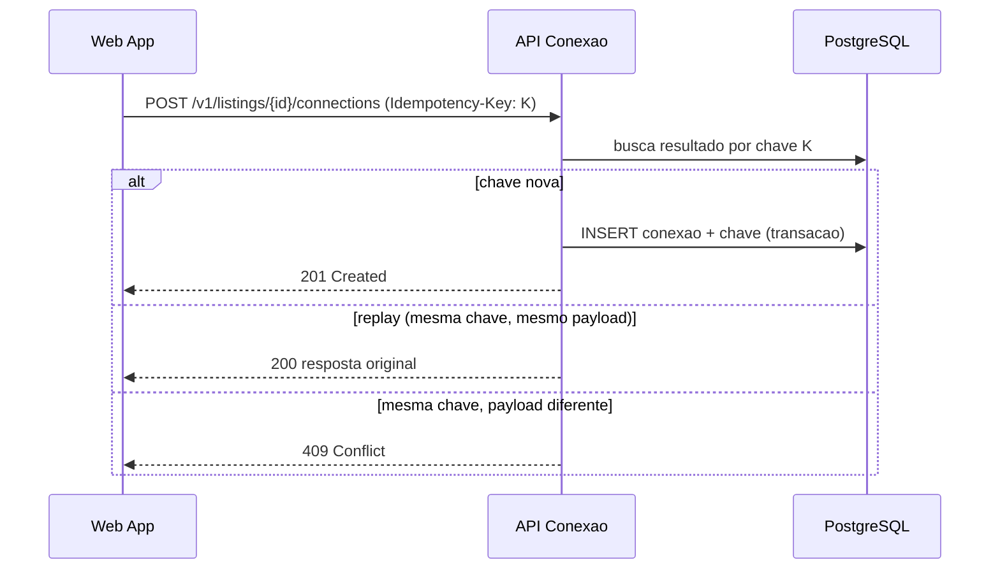

# ADR-roomie-004 — API

## Status
Proposto

## Contexto
Cliente web único consome a aplicação. Casos de borda do PRD exigem tratamento explícito: clique duplo não pode duplicar (submissão duplicada), e dois contatos no mesmo anúncio devem ambos registrar sem sobrescrever (acesso concorrente).

## Decisão
**REST/JSON sobre HTTPS**, versionado em `/v1`, `snake_case`, timestamps ISO 8601 UTC.

- **Erro padronizado** único em todos os endpoints (`code`, `message` sem vazar interno, `request_id`); validação reporta todas as falhas.
- **Paginação por cursor** em toda coleção (catálogo incluso), com limite máximo imposto no servidor. `[PRECISA DE INPUT: tamanho de página]`
- **Filtros allowlisted**; todo campo filtrável deve ser indexado (senão é vetor de DoS). v1 mínimo: faixa de valor. `[PRECISA DE INPUT: demais filtros — RF-12]`
- **Idempotência**: `POST` que cria (anúncio, conexão) exige `Idempotency-Key`; replay retorna a resposta original, mesma chave com payload diferente retorna `409`. Isso resolve clique duplo; contatos concorrentes legítimos usam chaves distintas e ambos registram.
- Autenticação em todo endpoint salvo os públicos listados (catálogo/detalhe de leitura).

## Contratos (v1, superfície inicial)

| Método + rota | Uso |
|---|---|
| `POST /v1/sessions` · `DELETE /v1/sessions` | login/logout (ADR-002) |
| `POST /v1/users` · `GET/PATCH/DELETE /v1/users/me` | conta e perfil (RF-02/04) |
| `POST /v1/listings` · `GET /v1/listings` · `GET/PATCH/DELETE /v1/listings/{id}` | anúncios + catálogo (RF-05/07/10/11) |
| `POST /v1/listings/{id}/connections` · `GET /v1/connections` | primeiro contato (RF-18/20) |
| `POST /v1/users/{id}/reviews` | reputação (RF-15) — regra de elegibilidade `[PRECISA DE INPUT]` |
| `POST /v1/reports` | denúncia (RF-21) |
| `POST /v1/uploads` | URL pré-assinada para foto (RNF-07) |

Mudanças aditivas não sobem versão; remoções/renome/mudança de tipo ou de `code` de erro exigem `/v2` com header `Deprecation` e migração dos clientes (expand-then-contract).

## Alternativas
1. **GraphQL** — flexível de consulta, mas custo de cache/complexidade injustificado para um cliente único e catálogo tabular.
2. **RPC/gRPC** — pensado para serviço-a-serviço; não há segundo serviço.
3. **REST (escolhida)** — o padrão do `standards/api-guidelines.md`; a opção chata.

## Trade-offs
Abrimos mão da economia de payload sob medida do GraphQL; em troca ganhamos cacheabilidade, simplicidade e alinhamento com o guia. Idempotência custa armazenar chaves (≥ 24 h), preço aceitável para não duplicar anúncio/contato.

## Consequências
- Toda coleção paginada desde o dia 1; UI precisa lidar com cursor.
- Contrato de erro fixo permite tratamento único no cliente.

## Ações de acompanhamento
- `[PRECISA DE INPUT]` tamanho de página, filtros/ordenações (RF-12/13), campos obrigatórios do anúncio (RF-06).

## Última verificação
2026-07-31
