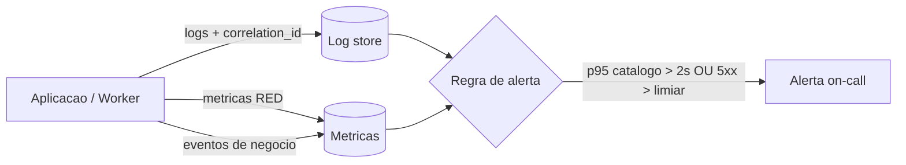

# ADR-roomie-005 — Observabilidade

## Status
Proposto

## Contexto
Sem visão externa não há operação (princípio de observabilidade). Alvos de latência/disponibilidade dependem de input, mas a instrumentação não.

## Decisão
- **Logs estruturados** (chave-valor) com `correlation_id` em toda entrada, propagado do request ao worker via outbox.
- **Métricas RED** (rate, errors, duration) por endpoint e por dependência (DB, object storage, provedor de e-mail).
- **Eventos de negócio** emitidos: `anuncio_publicado`, `conexao_iniciada`, `denuncia_registrada` — alimentam as métricas de sucesso do PRD.
- **Health vs. readiness** distintos.
- **Alertar por sintoma visível ao usuário**, não por causa. Sinal que estraga primeiro: **latência p95 do catálogo** e **taxa de 5xx no catálogo/detalhe** (o caminho que todo buscador usa).

## Alternativas
1. **Só logs** — barato, mas sem métricas não há alerta por sintoma nem SLO mensurável.
2. **Tracing distribuído completo (OpenTelemetry ponta a ponta)** — valioso entre serviços; aqui há um monólito, então o valor marginal é baixo no v1 (mantemos correlation_id, que basta).
3. **RED + logs estruturados + eventos (escolhida)** — cobre operação e as métricas de produto com esforço proporcional.

## Trade-offs
Abrimos mão de tracing distribuído rico agora; num monólito o `correlation_id` reconstrói o request. Se e quando surgir um segundo serviço, adotar tracing vira pré-requisito.

## Consequências
- SLO de 99,5%/p95 2 s fica mensurável assim que confirmado (RNF-01/03).
- Eventos de negócio dão as métricas de sucesso sem instrumentação extra.

## Ações de acompanhamento
- `[PRECISA DE INPUT]` alvos numéricos (RNF-01/02/03) para calibrar limiares.

## Última verificação
2026-07-31
