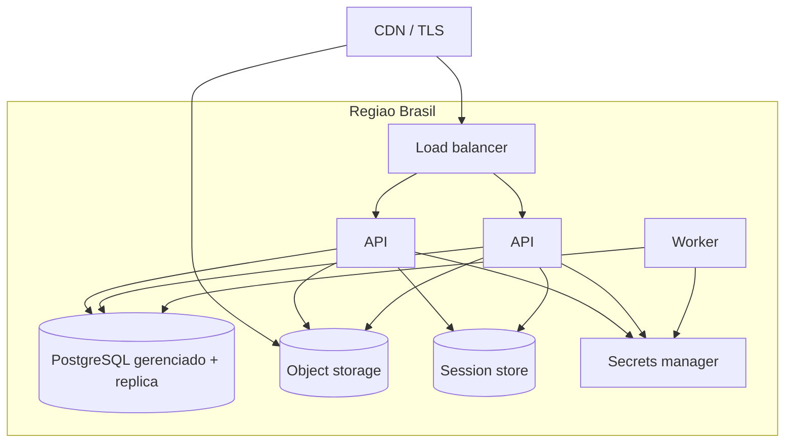

# ADR-roomie-006 — Infraestrutura

## Status
Proposto

## Contexto
Público pt-BR; LGPD favorece dados em região Brasil (latência e base legal). Escala v1 indefinida — evitar sobre-provisionar.

## Decisão
**PaaS gerenciado, região Brasil**, com contêineres stateless atrás de load balancer:

- **Aplicação (monólito modular)** e **Worker** em contêiner, escaláveis horizontalmente; nenhum estado autoritativo em memória.
- **PostgreSQL gerenciado** com réplica de leitura (esquema no `ADR-roomie-003`).
- **Object storage S3-compatível + CDN** para fotos; upload/download por URL pré-assinada (o binário não passa pela API).
- **Store de sessão** gerenciado (ADR-002).
- Config por ambiente; segredos em **secrets manager**, nunca no código.

`[PRECISA DE INPUT: preferência de provedor de nuvem da organização]` — decisão vale para qualquer nuvem com esses primitivos gerenciados.

## Alternativas
1. **VM única / servidor pet** — mais barato no dia 1, mas sem escala horizontal nem restart seguro; não atende 99,5%.
2. **Kubernetes próprio** — flexível, mas sobrecarga operacional que nenhum requisito v1 pede (sobre-engenharia).
3. **PaaS gerenciado (escolhida)** — a opção chata; entrega stateless, gerenciado e barato de operar.

## Trade-offs
Abrimos mão de controle fino e de portabilidade multi-nuvem (algum lock-in de PaaS) em troca de menor custo operacional e velocidade. Fotos fora da API custam a complexidade da URL pré-assinada, mas removem o gargalo de banda e o risco de upload malicioso no processo da API.

## Consequências
- Escala horizontal exige que a sessão fique no store compartilhado (coerente com ADR-002).
- Região única: DR entre regiões é decisão futura, não v1.

## Ações de acompanhamento
- `[PRECISA DE INPUT]` provedor e alvos de escala (RNF-02).

## Última verificação
2026-07-31
