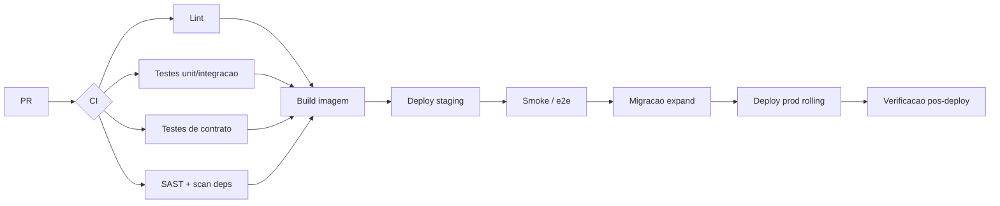

# ADR-roomie-007 — CI/CD

## Status
Proposto

## Contexto
LGPD e reputação de marca exigem release confiável; deploy rolling implica versões concorrentes vivas ao mesmo tempo.

## Decisão
**Trunk-based** com pipeline por PR e deploy contínuo:

- CI: lint, testes unit/integração, **testes de contrato** na fronteira da API, SAST + scan de dependências, build de imagem.
- **Migrações expand-then-contract**: expandir (aditivo) antes do deploy do código; contrair (remover) só depois que nenhum consumidor usa o antigo — nunca numa só etapa.
- **Deploy rolling** que tolera versões mistas; o schema deve ser compatível com a versão anterior durante o rollout.
- Promoção staging → produção, com smoke/e2e em staging e verificação pós-deploy.

## Alternativas
1. **Deploy manual** — sem gate reprodutível; risco de erro humano em release com PII.
2. **Blue-green** — troca atômica evita versões mistas, mas dobra o custo de infra e ainda exige migração compatível para rollback; excesso para o v1.
3. **Rolling + expand-contract (escolhida)** — barato e seguro se as migrações forem disciplinadas.

## Trade-offs
Abrimos mão da simplicidade de "uma migração, um deploy": toda mudança de schema vira duas ou três etapas. Em troca, deploys nunca quebram a versão que ainda está no ar.

## Consequências
- Toda migração destrutiva precisa de janela de expand→migração de consumidores→contract.
- Testes de contrato tornam-se gate obrigatório (detalhe no `ADR-roomie-009`).

## Ações de acompanhamento
- `ADR-roomie-009` (qa): definir suíte e limiares de cobertura.

## Última verificação
2026-07-31
