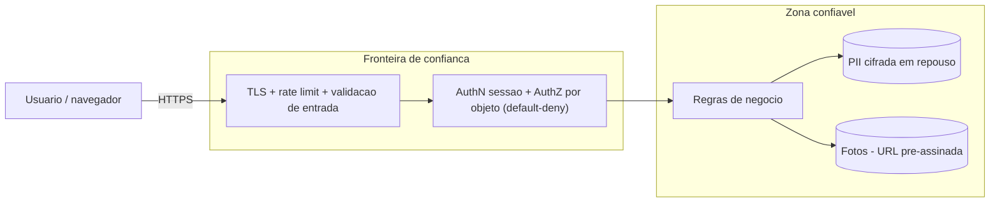

# ADR-roomie-008 — Segurança

## Status
Proposto

## Contexto
Roomie trata PII sensível (nome, foto, contato) de estudantes; LGPD é requisito, não opção (RNF-05). Golpe/conteúdo impróprio são riscos do PRD. Foto é upload de usuário — gatilho de revisão de segurança.

## Decisão
Tudo que vem do navegador é **não confiável**; a fronteira de confiança concentra as defesas:

- **Default deny** e **autorização por objeto**: `GET/PATCH/DELETE /v1/listings/{id}` exige que o autor seja o dono (ou moderador). Sessão válida não basta — previne IDOR (RF-07, CA-08).
- **Validação de entrada** no boundary, por allowlist (tipo, faixa, tamanho, formato); toda coleção limitada.
- **Upload de fotos**: URL pré-assinada, validação de tipo e tamanho no servidor. `[PRECISA DE INPUT: nº máx., tamanho, formatos — RNF-07]`
- **TLS em tudo**, incl. chamadas internas; **PII cifrada em repouso** (KMS da plataforma, rotação sem downtime).
- **LGPD by design**: base legal e consentimento no cadastro/foto; direito de exclusão e portabilidade desde o v1. Exclusão de conta e destino de anúncios/reputação: `[PRECISA DE INPUT — borda do PRD]`
- **Rate limit** em login, cadastro, reset, busca e denúncia, por usuário e IP.
- Segredos só via ambiente/secrets manager.

## Alternativas
1. **Autorização só por rota (sessão logada)** — mais simples, mas é exatamente o IDOR que o `standards/security.md` proíbe.
2. **Anonimizar/pseudonimizar PII agressivamente** — reduz risco, mas quebra reputação por pessoa e o contato mediado (requisito de produto).
3. **Default-deny por objeto + LGPD by design (escolhida)** — atende requisito e princípio.

## Trade-offs
Abrimos mão de conveniência de desenvolvimento: cada endpoint que toca objeto precisa de checagem de posse explícita e cada campo de PII de base legal. Em troca, evitamos a falha mais comum de reviews reais (IDOR) e o risco legal LGPD.

## Consequências
- Fluxo de exclusão/portabilidade LGPD é feature de v1, não posterior.
- Mudanças em auth, autorização, PII e upload disparam revisão humana de segurança.

## Ações de acompanhamento
- `[PRECISA DE INPUT]` limites de upload (9), exclusão de conta com anúncios/reputação (11), quem modera e quais regras (6).

## Última verificação
2026-07-31
