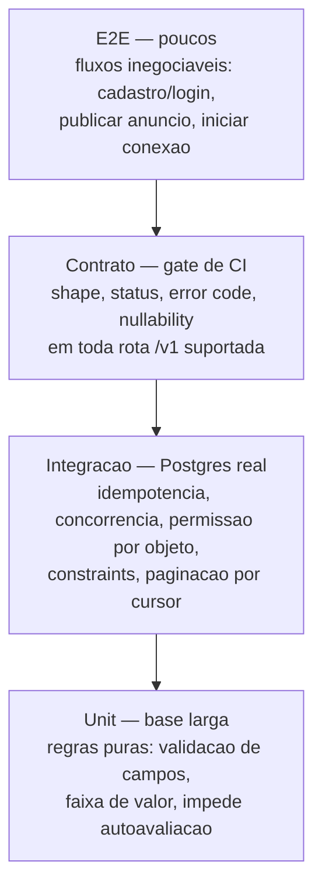

# ADR-roomie-009 — Testes

## Status
Proposto

## Decisão
Adotamos a pirâmide de testes clássica com quatro níveis, cada um com escopo fixo. **Testes de contrato na fronteira `/v1` são gate obrigatório de CI** (ADR-004/007): nenhum merge passa com contrato quebrado. **Idempotência** (clique duplo não duplica anúncio/conexão) e **acesso concorrente** (dois contatos no mesmo anúncio ambos registram, sem sobrescrita) têm teste explícito e obrigatório de integração — são os casos de borda de maior consequência.

## Alternativas
1. **Só E2E** — cobre o fluxo real mas é lento, flaky e não aponta a causa; rejeitado como base de cobertura.
2. **Só unit + mocks nos dois lados da fronteira** — mocks concordam entre si e erram juntos; por isso o contrato é gate.
3. **Pirâmide com contrato no gate (escolhida)** — alinhada ao `testing-standards.md` e ao expand-then-contract do ADR-007.

## Matriz de cobertura (CA → nível de teste)

| CA | Nível primário | Bloqueio de input |
|---|---|---|
| CA-01 Publicar | Integração + E2E | Lacuna: campos obrigatórios (RF-06) e elegibilidade (RF-03) |
| CA-02 Campo faltante | Unit (validação) + contrato (erro reporta todas as falhas) | Lacuna: lista definitiva de campos |
| CA-03 Filtrar por valor | Integração (índice) + contrato | Testável agora; demais filtros pendentes |
| CA-04 Ver reputação | Integração + contrato | Testável agora (exibição) |
| CA-05 Iniciar conexão | Integração (registro + concorrência) + E2E | Lacuna: canal de notificação (RF-19) |
| CA-06 Reputação pós-interação | Unit (impede autoavaliação) | **Bloqueado**: modelo/"conexão elegível" (RF-15) |
| CA-07 Denúncia/remoção | Integração (registro) | Lacuna: quem modera e regras (RF-22) |
| CA-08 Editar/excluir próprio | Integração (autorização por objeto) | Testável agora |

## Trade-offs
Contrato como gate custa manutenção de fixtures de contrato e disciplina de versionamento; em troca, evita divergência silenciosa cliente/servidor. Integração com Postgres real (não SQLite) é mais lenta, mas é o único lugar onde idempotência, concorrência e constraints aparecem.

## Consequências
- CI vermelho se o contrato `/v1` mudar de forma incompatível sem `/v2`.
- Idempotência e concorrência viram testes de regressão permanentes.
- Testes determinísticos: relógio injetado, sem rede real, `Idempotency-Key` fixado, ordem randomizada em CI.

## Ações de acompanhamento
Lacunas rastreadas (não silenciosas), cada uma trava o CA correspondente até input:
- **CA-06 bloqueado** — modelo de reputação, escala, antiabuso, definição de "conexão elegível" (PRD Q3 / RF-15/16/17). Só a regra "impede autoavaliação" é testável hoje.
- **CA-01/CA-02** — lista definitiva de campos obrigatórios (RF-06) e regra de elegibilidade de cadastro (RF-03).
- **CA-05** — mecanismo do primeiro contato e canal de notificação (RF-18/19/20).
- **CA-07** — papel do moderador e regras de remoção (RF-22).
- Confirmar tamanho de página (afeta teste de paginação por cursor) e filtros adicionais (RF-12).

## Última verificação
2026-07-31
