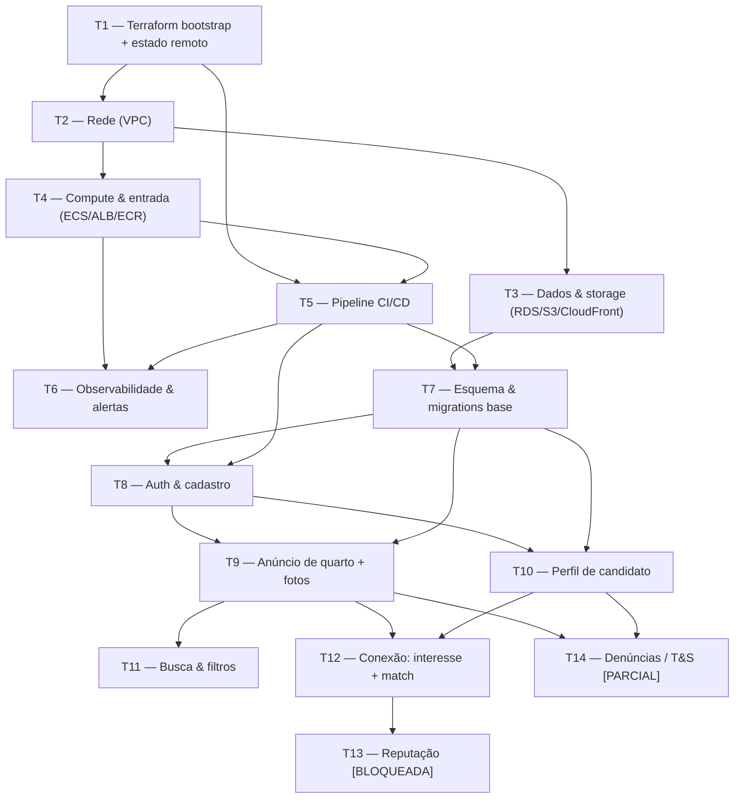

# ROM — Plano de Construção

A arquitetura documentada, quebrada em tarefas que um engenheiro pega. É a
entrega final do kickoff. Cada tarefa é construída depois, separadamente (ex.:
via `/li-feature`), **não** nesta execução. Idioma pt-BR; IDs, código e SQL neutros.

## Ordenação

Construa de cima para baixo. Cada tarefa lista o que precisa existir antes de
começar. As tarefas **T1–T6 são a fundação de infraestrutura e entrega** (toda a
infra de `ADR-ROM-006` e o pipeline de `ADR-ROM-007`, até um ambiente
deployável); as tarefas de aplicação dependem dela. Tarefas bloqueadas por
`[PRECISA DE INPUT]` estão marcadas — **não comece por elas** até a lacuna do
`PRD-ROM-001` ser resolvida.

## Grafo de dependências

## Tarefas

### T1 — Terraform bootstrap + estado remoto
- **Implements:** `ADR-ROM-006` (IaC)
- **Depends on:** nenhuma
- **Scope:** repositório Terraform, backend de estado remoto (**S3 + trava
  DynamoDB**), conta/região `sa-east-1`, IAM base e convenções de módulo.
- **Acceptance criteria:** Dado um `terraform plan/apply` limpo, Quando roda em
  CI, Então o estado persiste no S3 e a trava DynamoDB impede apply concorrente.

### T2 — Rede (VPC)
- **Implements:** `ADR-ROM-006`
- **Depends on:** T1
- **Scope:** VPC, subnets públicas/privadas, security groups e roteamento para
  ALB, ECS e RDS.
- **Acceptance criteria:** Dado o apply, Quando a rede sobe, Então ECS alcança o
  RDS em subnet privada e só o ALB é exposto publicamente.

### T3 — Dados & storage (RDS / S3 / CloudFront)
- **Implements:** `ADR-ROM-006`, `ADR-ROM-003`, `ADR-ROM-008`
- **Depends on:** T2
- **Scope:** **Amazon RDS for PostgreSQL** (backups automáticos + PITR, cifrado
  com KMS), bucket **S3** para fotos e **CloudFront** como CDN. Dimensionamento
  (classe RDS, multi-AZ) provisório `[PRECISA DE INPUT]` (RNF-4/5).
- **Acceptance criteria:** Dado o apply, Quando os recursos sobem, Então o RDS
  aceita conexão da VPC com backups/PITR habilitados e o S3 serve objetos via
  CloudFront sob TLS.

### T4 — Compute & entrada (ECS / ALB / ECR)
- **Implements:** `ADR-ROM-006`
- **Depends on:** T2
- **Scope:** cluster **ECS Fargate** para o monólito, **ALB** com TLS via
  **ACM**, repositório **ECR**. Auto-scaling da task provisório `[PRECISA DE INPUT]`.
- **Acceptance criteria:** Dado uma imagem no ECR, Quando uma task roda, Então o
  ALB roteia com health check e a task escala horizontalmente sem afinidade de
  sessão (sessão no RDS, `ADR-ROM-002`).

### T5 — Pipeline CI/CD
- **Implements:** `ADR-ROM-007`
- **Depends on:** T1, T4
- **Scope:** pipeline trunk-based `lint → test → scan → build → push ECR (por
  digest) → terraform apply → migrations RDS → deploy ECS rolling → health check`,
  com **build-once/promote-the-same-digest** e rollback por digest anterior.
- **Acceptance criteria:** Dado um push na `main`, Quando o pipeline roda, Então
  testes/scan bloqueiam merge em falha, a mesma imagem é promovida (sem rebuild) e
  um deploy saudável fica servindo; Dado uma task não-saudável, Então o rollback
  re-aponta o digest anterior.

### T6 — Observabilidade & alertas
- **Implements:** `ADR-ROM-005`
- **Depends on:** T4, T5
- **Scope:** OpenTelemetry (logs estruturados + métricas + traces), `request_id`
  correlacionado, contadores do funil-norte, e alertas mínimos (5xx acima de
  limiar, conexões-norte = 0).
- **Acceptance criteria:** Dado um pico de 5xx ou queda a zero de conexões-norte,
  Quando ocorre, Então o on-call é notificado. *Limiares viram SLO quando
  RNF-3/5 saírem de `[PRECISA DE INPUT]`.*

### T7 — Esquema & migrations base
- **Implements:** `ADR-ROM-003`
- **Depends on:** T3, T5
- **Scope:** esquema normalizado (users, listings, candidate_profiles, photos,
  interests, matches, reports, reputation_stub, reputation_events) com as
  invariantes: `UNIQUE (author_id, target_id)` em interests e
  `CHECK (user_low < user_high)` + `UNIQUE (user_low, user_high)` em matches.
  Índice em toda FK. Migração escrita via `li-database-change` e aplicada pelo
  pipeline (T5).
- **Acceptance criteria:** Dado interesse repetido do mesmo par, Quando inserido,
  Então o banco rejeita duplicata; Dado um par de match em qualquer ordem, Então
  só um registro existe.

### T8 — Auth & cadastro
- **Implements:** `ADR-ROM-002` (RF-1, RF-2, RF-3)
- **Depends on:** T5, T7
- **Scope:** cadastro e login por e-mail+senha (Argon2id), sessão em cookie
  httpOnly, verificação de e-mail obrigatória antes de publicar, um cadastro
  atuando nas duas pontas, reset de senha.
- **Acceptance criteria:** Dado um usuário com credenciais válidas e e-mail
  verificado, Quando faz login, Então recebe sessão; Dado e-mail não verificado,
  Então recebe 403 com reenvio. *Verificação de vínculo estudantil (RF-2) é
  `[PRECISA DE INPUT]` — implementar o default provisório (e-mail institucional)
  isolado atrás de uma política.*

### T9 — Anúncio de quarto + fotos
- **Implements:** `ADR-ROM-004`, `ADR-ROM-003` (RF-4, RF-5, RF-6)
- **Depends on:** T8, T7 (e o S3/CloudFront de T3)
- **Scope:** publicar/editar/pausar/encerrar anúncio com campos padronizados
  obrigatórios e upload de fotos para S3 (validação de tipo/tamanho), servidas
  via CloudFront.
- **Acceptance criteria:** Dado um usuário autenticado com todos os campos
  obrigatórios, Quando publica, Então o anúncio fica buscável; Dado um campo
  obrigatório faltante, Então o sistema bloqueia e aponta o campo (400 problem+json).

### T10 — Perfil de candidato
- **Implements:** `ADR-ROM-004`, `ADR-ROM-003` (RF-7)
- **Depends on:** T8, T7
- **Scope:** publicar/editar perfil de candidato (o que procura, faixa de valor,
  preferências), reutilizando o mesmo cadastro.
- **Acceptance criteria:** Dado um usuário autenticado, Quando cria um perfil de
  candidato, Então ele fica visível à outra ponta (sem dados de contato).

### T11 — Busca & filtros
- **Implements:** `ADR-ROM-004` (RF-8)
- **Depends on:** T9
- **Scope:** busca de anúncios com filtros comparáveis combinados em AND; estado
  vazio explícito.
- **Acceptance criteria:** Dado um catálogo com anúncios, Quando o candidato
  aplica filtros, Então só retornam anúncios que satisfazem todos; Dado filtro
  sem resultado, Então exibe estado vazio (200, sem erro). *Critérios exatos e
  índices dependem do escopo geográfico `[PRECISA DE INPUT]` (RNF-6).*

### T12 — Conexão: interesse + match (caminho crítico)
- **Implements:** `ADR-ROM-004`, `ADR-ROM-008` (RF-10, RF-11, RF-12)
- **Depends on:** T9, T10
- **Scope:** `PUT /v1/interests` idempotente; match derivado no servidor em
  transação única que libera contato e registra a conexão-norte; contato oculto
  até o match (authz no servidor).
- **Acceptance criteria:** Dado interesse recíproco de A e B, Quando o segundo é
  enviado, Então forma-se um match, o contato é liberado e a conexão é registrada
  uma vez; Dado dois cliques do mesmo usuário no mesmo alvo, Então não há
  duplicação; Dado que não há match, Então a API nunca inclui contato no payload
  (mesmo por chamada direta). *Forma da mediação (chat vs. troca de contato, RF-11)
  é `[PRECISA DE INPUT]` — o canal fica atrás de uma interface.*

### T13 — Reputação — **[BLOQUEADA]**
- **Implements:** `ADR-ROM-003` (stub), feature futura `ADR-ROM-010+` (RF-9)
- **Depends on:** T12
- **Scope:** exibir a reputação por usuário antes do contato e alimentar
  `reputation_events`. **Bloqueada:** a regra de composição de `score_cached` é
  `[PRECISA DE INPUT]` — o coração do produto (RF-9) ainda não está definido.
- **Acceptance criteria:** Dado um perfil sem reputação, Quando exibido, Então
  mostra "sem histórico" (nunca `0`). *O cálculo e demais critérios ficam abertos
  até o modelo de reputação ser decidido — abrir `ADR-ROM-010` primeiro.*

### T14 — Denúncias / Trust & Safety — **[PARCIAL]**
- **Implements:** `ADR-ROM-008` (RF-13)
- **Depends on:** T9, T10
- **Scope:** registrar denúncias de anúncios e usuários para triagem;
  rate-limiting anti-abuso. **A ação de moderação subsequente é `[PRECISA DE INPUT]`**
  — no MVP a denúncia apenas registra.
- **Acceptance criteria:** Dado um anúncio ou usuário, Quando alguém denuncia,
  Então a denúncia é registrada para triagem. *Fluxo de moderação pós-registro
  fica aberto.*

## Fora deste plano

- **Modelo de reputação (RF-9)** — decisão de produto pendente; destrava T13 e abre
  `ADR-ROM-010`.
- **Método de verificação de vínculo (RF-2)**, **fluxo de moderação (RF-13)**,
  **forma da mediação de contato (RF-11)** — todos `[PRECISA DE INPUT]`.
- **Monetização / pagamento**, **multi-região / multi-AZ**, **MFA**, **login
  social** — fora do MVP (ver ADRs 002, 006, 008).
- **Dimensionamento de infra e índices de busca** — dependem de escala/escopo
  (RNF-4/5/6) `[PRECISA DE INPUT]`.

## Last verified
2026-07-31
