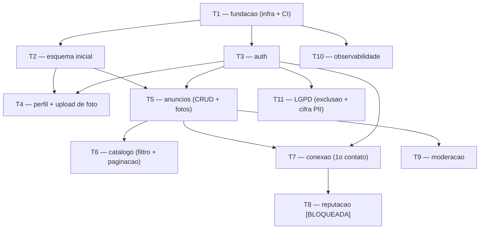

# roomie — Plano de Construção

A arquitetura documentada, quebrada em tarefas que um engenheiro pega. Este é o
entregável final do kickoff. Cada tarefa é construída depois, separadamente
(ex.: via `/feature`), não nesta rodada.

## Ordem

Construir de cima para baixo. Cada tarefa lista o que precisa existir antes.
T1–T3 são a espinha. Tarefas marcadas **[BLOQUEADA]** dependem de uma pergunta
em aberto do PRD e não devem começar antes da resposta.

## Perguntas em aberto que travam tarefas

- Modelo de reputação (Q3 / RF-15/16/17) → T8
- Elegibilidade de cadastro (Q2 / RF-03) → T3
- Mecanismo/canal do primeiro contato (Q4 / RF-18/19/20) → T7
- Campos obrigatórios do anúncio (Q7 / RF-06) → T5
- Exclusão de conta; limites de upload (Q11, Q9) → T4, T11

## Grafo de dependências

## Tarefas

### T1 — Fundação: infra + CI
- **Implementa:** `ADR-roomie-006`, `ADR-roomie-007`
- **Depende de:** nada
- **Escopo:** esqueleto da app (monólito modular) + worker + web responsiva; PaaS região Brasil, Postgres gerenciado, object storage + CDN, session store, secrets manager; pipeline trunk-based (lint, testes, contrato, SAST, build, deploy rolling) com migração expand-then-contract.
- **Critérios de aceitação:** uma mudança trivial flui por CI até staging; segredos fora do código; deploy rolling tolera versões mistas.

### T2 — Esquema inicial
- **Implementa:** `ADR-roomie-003`
- **Depende de:** T1
- **Escopo:** migração de criação (rodada por humano) das tabelas-núcleo + `idempotency_keys` e `outbox_eventos`, com índices nomeados. Sem colunas travadas por perguntas em aberto.
- **Critérios de aceitação:** migração aplica e reverte limpa; FKs indexadas; enums de estado criados.

### T3 — Autenticação
- **Implementa:** `ADR-roomie-002`, `ADR-roomie-008`
- **Depende de:** T1
- **Escopo:** cadastro, login (`POST /v1/sessions`), sessão em cookie httpOnly no store compartilhado, hash Argon2, rate limit. Gate de elegibilidade isolado. `[BLOQUEADA em parte: RF-03]`
- **Critérios de aceitação:** RNF-06 — não autenticado não publica/contata/avalia; falha genérica sem enumeração.

### T4 — Perfil + upload de foto
- **Implementa:** `ADR-roomie-003`, `ADR-roomie-008`
- **Depende de:** T2, T3
- **Escopo:** perfil (nome, foto) com upload por URL pré-assinada; validação de tipo/tamanho no servidor. `[PRECISA DE INPUT: limites de upload — Q9]`
- **Critérios de aceitação:** foto sobe via URL pré-assinada (binário não passa pela API); PII marcada para cifra em repouso.

### T5 — Anúncios (CRUD + fotos)
- **Implementa:** `ADR-roomie-004`, `ADR-roomie-003`
- **Depende de:** T2, T3
- **Escopo:** criar/editar/despublicar/excluir anúncio próprio (RF-05/07), com fotos e valor; autorização por objeto (CA-08). `[PRECISA DE INPUT: campos obrigatórios — Q7]`
- **Critérios de aceitação:** CA-01, CA-02, CA-08 — publicar exige campos obrigatórios; não-dono recebe 403.

### T6 — Catálogo (filtro + paginação)
- **Implementa:** `ADR-roomie-004`
- **Depende de:** T5
- **Escopo:** listar anúncios publicados; filtro por faixa de valor (índice `anuncios(status, valor)`); paginação por cursor; estado vazio. `[PRECISA DE INPUT: demais filtros — Q8]`
- **Critérios de aceitação:** CA-03, CA-04 — filtro por valor retorna só publicados na faixa; detalhe exibe reputação do anunciante.

### T7 — Conexão (primeiro contato)
- **Implementa:** `ADR-roomie-004`
- **Depende de:** T5, T3
- **Escopo:** `POST /v1/listings/{id}/connections` com `Idempotency-Key` (clique duplo não duplica), registro para métrica, notificação ao anunciante. `[PRECISA DE INPUT: mecanismo/canal — Q4]`
- **Critérios de aceitação:** CA-05 — conexão registrada e anunciante notificado; dois contatos concorrentes ambos registram; replay retorna a resposta original.

### T8 — Reputação  [BLOQUEADA]
- **Implementa:** `ADR-roomie-003`, RF-14/15/16
- **Depende de:** T7 + resposta da Q3
- **Escopo:** avaliações elegíveis por conexão, agregado (`reputacao_agregada`) com refresh nomeado, anti-autoavaliação. **Não iniciar sem o modelo de reputação definido.**
- **Critérios de aceitação:** CA-06 (quando desbloqueada) — reputação atualiza; ninguém se autoavalia.

### T9 — Moderação
- **Implementa:** RF-21/22
- **Depende de:** T5
- **Escopo:** denunciar anúncio/pessoa; fila de moderação; remoção pelo moderador. `[PRECISA DE INPUT: quem modera e regras — Q6]`
- **Critérios de aceitação:** CA-07 — denúncia registrada; moderador remove do catálogo.

### T10 — Observabilidade
- **Implementa:** `ADR-roomie-005`
- **Depende de:** T1
- **Escopo:** logs estruturados + `correlation_id`, métricas RED, eventos de negócio, health/readiness, alerta por sintoma (p95 e 5xx do catálogo).
- **Critérios de aceitação:** catálogo lento/erro dispara alerta; eventos de negócio alimentam as métricas de sucesso.

### T11 — LGPD (exclusão + cifra de PII)
- **Implementa:** `ADR-roomie-008`, RNF-05
- **Depende de:** T3
- **Escopo:** cifra em repouso das colunas de PII; fluxo de exclusão e portabilidade de dados. `[PRECISA DE INPUT: destino de anúncios/reputação na exclusão — Q11]`
- **Critérios de aceitação:** titular exclui a conta e exporta seus dados; PII cifrada em repouso.

## Fora deste plano
- Pagamento/contrato de locação, app nativo, chat em tempo real, matching automático (PRD Fora de escopo).
- Alvos de performance (p95, escala) até RNF-01/02 confirmados.

## Última verificação
2026-07-31
