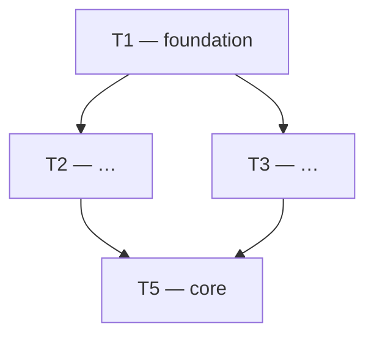

# {SLUG} — Build Plan

The documented architecture, broken into tasks an engineer can pick up. This
is the kickoff's final deliverable. Each task is built separately afterward
(e.g. via `/li-feature`), not in the kickoff run.

## Ordering

Build tasks top to bottom. A task lists what must exist before it starts.

## Dependency graph

## Tasks

### T1 — <short title>

- **Implements:** `ADR-{SLUG}-00N` (and the PRD requirement it satisfies)
- **Depends on:** none | T-n
- **Scope:** one or two sentences — what gets built.
- **Acceptance criteria:** Given/When/Then, drawn from the PRD and
  `ADR-{SLUG}-009` (testing). How QA proves it done.

### T2 — <short title>

- **Implements:**
- **Depends on:** T1
- **Scope:**
- **Acceptance criteria:**

## Not in this plan

Decisions deferred, features pushed to a later cut, known gaps.

## Last verified
YYYY-MM-DD
