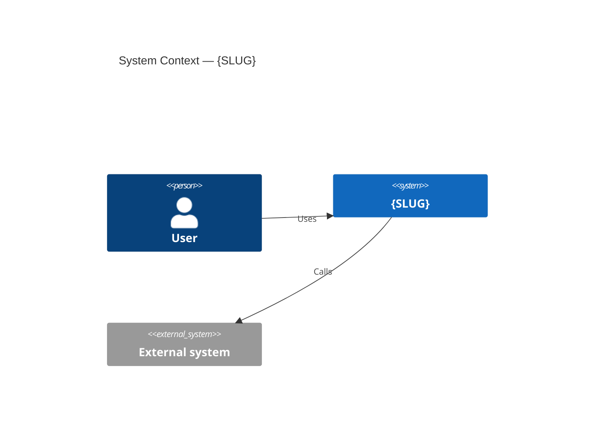
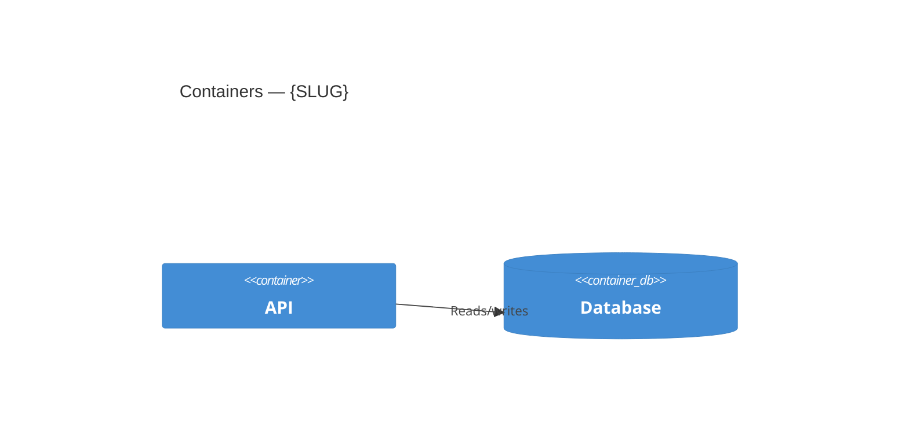

# ADR-{SLUG}-001 — System Design Document

## Status

## Context

Why this system exists. Link to `PRD-{SLUG}-001`.

## C4 — Level 1: System Context

Who and what the system talks to. One diagram.

## C4 — Level 2: Containers

The deployable/runnable units and the data stores. One diagram.

## C4 — Level 3: Components

The internal pieces of the container that matters most. One diagram.

## Key decisions & their ADRs

| Concern | Decision | ADR |
|---|---|---|
| auth | | `ADR-{SLUG}-002` |
| database | | `ADR-{SLUG}-003` |
| api | | `ADR-{SLUG}-004` |
| observability | | `ADR-{SLUG}-005` |
| infrastructure | | `ADR-{SLUG}-006` |
| ci/cd | | `ADR-{SLUG}-007` |
| security | | `ADR-{SLUG}-008` |
| testing | | `ADR-{SLUG}-009` |

## Cross-cutting constraints

Latency, scale, availability, compliance — with numbers.

## Follow-up Actions

## Last verified
YYYY-MM-DD
