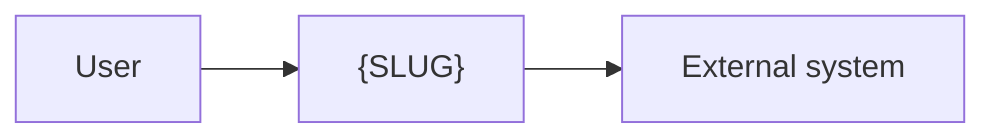
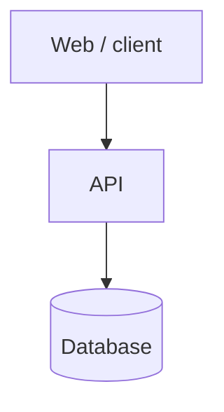
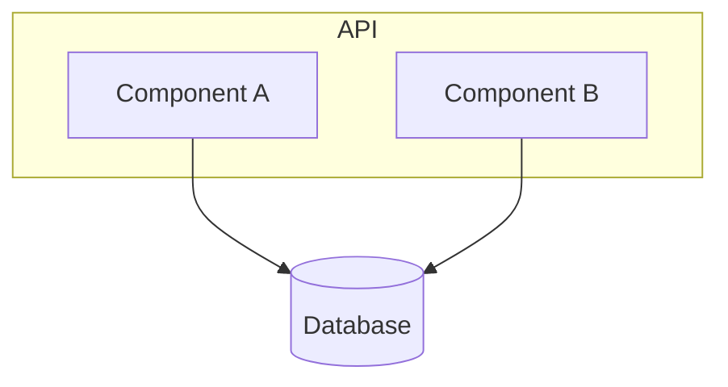

# ADR-{SLUG}-001 — System Design Document

## Status

## Context

Why this system exists. Link to `PRD-{SLUG}-001`.

> Use plain `flowchart` diagrams (not the `C4Context`/`C4Container` mermaid
> dialect — it renders poorly in many previews). Keep each to a handful of
> nodes and open every level with a one-line caption saying what it shows.

## Level 1 — System context

**What this shows:** who uses {SLUG} and which external systems it talks to.

## Level 2 — Containers

**What this shows:** the deployable/runnable units and the data stores inside
{SLUG}, and how they connect.

## Level 3 — Components

**What this shows:** the internal pieces of the one container that matters most
(usually the API), and which one owns each responsibility.

## Key decisions & their ADRs

| Concern | Decision | ADR |
|---|---|---|
| auth | | `ADR-{SLUG}-002` |
| database | | `ADR-{SLUG}-003` |
| api | | `ADR-{SLUG}-004` |
| observability | | `ADR-{SLUG}-005` |
| infrastructure | | `ADR-{SLUG}-006` |
| ci/cd | | `ADR-{SLUG}-007` |
| security | | `ADR-{SLUG}-008` |
| testing | | `ADR-{SLUG}-009` |

## Cross-cutting constraints

Latency, scale, availability, compliance — with numbers.

## Follow-up Actions

## Last verified
YYYY-MM-DD
